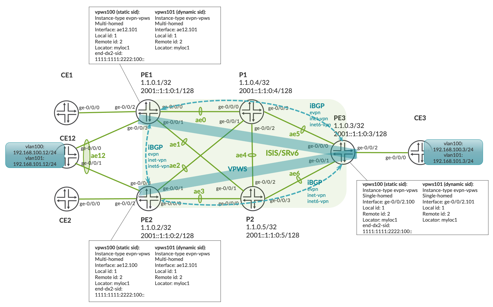
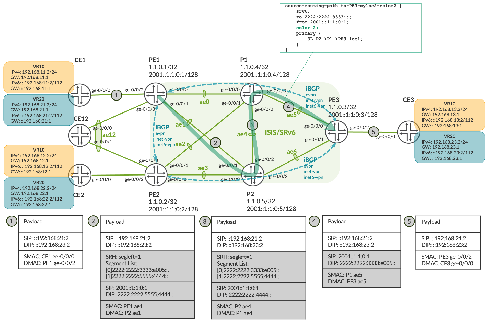

## SRv6 Demo

### Table of contents
* [Topology](Readme.md#Topology)
* [Core-facing interfaces](Readme.md#Core-facing-interfaces)
* [ISIS SRv6](Readme.md#ISIS-SRv6)
* [BGP](Readme.md#BGP)
* [Services](Readme.md#Services)
  * [EVPN VPWS](Readme.md#EVPN-VPWS)
  * [EVPN ELAN](Readme.md#EVPN-ELAN)
  * [L3VPN](Readme.md#L3VPN)
* [Traffic Engineering](Readme.md#SRv6-TE)
  * [Regular SRH](Readme.md#Regular-SRH)
  * [Compressed SRH](Readme.md#Compressed-SRH)

SRv6 is a new alternative to traditional MPLS services that operators have been using for decades. Here I'd like to demonstrate a way to build a virtual lab using Juniper devices and to configure the most popular services over SRv6 underlay.

### Topology
The first step is building a topology. You can go with physical devices if you have enough of them at your hand or opt for a virtual lab, which is a more cost-effective option available to anyone. Nowadays, Juniper and most network vendors provide virtualized and containerized Network Operating Systems. In my lab I'm using virtual MX and virtual EX. Setting up all virtual machines manually can be time-consuming, especially for complex network topologies with a Network Operating System consisting of two VMs (vMX). That is where the [Containterlab](https://containerlab.dev) project comes into play making the topology building process much easier. 

To begin with, we need to create containers from vMX and vEX images. This can be accomplished with the help of [vrnetlab](https://containerlab.dev/manual/vrnetlab/) through the following steps:
* Clone the [vrnetlab](https://github.com/hellt/vrnetlab) project.
* Download vMX and vEX images and copy them to the ``vrnetlab/vmx`` and ``vrnetlab/vjunosswitch`` folders, respectively.
* Run ```make``` in each folder.

As a result, you have the following Docker images:
```
$ sudo docker images
REPOSITORY                  TAG            IMAGE ID       CREATED        SIZE
vrnetlab/vr-vjunosswitch    23.2R1.14      e64bbda0e0dc   3 days ago     4.36GB
vrnetlab/vr-vmx             23.4R1.10      bb5ef5b27530   3 days ago     10.9GB
```

Once the docker images are in place, you start building the actual topology. I'm going to deploy three PE routers connected to two P routers, each PE router having a CE device connected to it: PE1-CE1, PE2-CE2, PE3-CE3. In addition, there is a multihomed CE12 connected to both PE1 and PE2 with an ae12 bundle. 


I created a container lab [topology file](https://github.com/agantonov/clab/blob/master/srv6-vmx.yml) where I specified Docker images and connections between containers. You can find more information about the syntax in the [user guide](https://containerlab.dev/manual/topo-def-file/). 

Now let's deploy the topology:
```
$ sudo containerlab deploy -t srv6-vmx.yml
+---+----------------+--------------+------------------------------------+----------------------+---------+-----------------+----------------------+
| # |      Name      | Container ID |               Image                |         Kind         |  State  |  IPv4 Address   |     IPv6 Address     |
+---+----------------+--------------+------------------------------------+----------------------+---------+-----------------+----------------------+
| 1 | clab-srv6-ce1  | e82cefae2584 | vrnetlab/vr-vjunosswitch:23.2R1.14 | juniper_vjunosswitch | running | 172.20.20.7/24  | 2001:172:20:20::7/64 |
| 2 | clab-srv6-ce12 | 2f11d3e4c57e | vrnetlab/vr-vjunosswitch:23.2R1.14 | juniper_vjunosswitch | running | 172.20.20.4/24  | 2001:172:20:20::4/64 |
| 3 | clab-srv6-ce2  | c250931e5676 | vrnetlab/vr-vjunosswitch:23.2R1.14 | juniper_vjunosswitch | running | 172.20.20.2/24  | 2001:172:20:20::2/64 |
| 4 | clab-srv6-ce3  | c8cd5381d9ac | vrnetlab/vr-vjunosswitch:23.2R1.14 | juniper_vjunosswitch | running | 172.20.20.5/24  | 2001:172:20:20::5/64 |
| 5 | clab-srv6-p1   | 14752a8f36df | vrnetlab/vr-vmx:23.4R1.10          | juniper_vmx          | running | 172.20.20.9/24  | 2001:172:20:20::9/64 |
| 6 | clab-srv6-p2   | 592017f1f182 | vrnetlab/vr-vmx:23.4R1.10          | juniper_vmx          | running | 172.20.20.10/24 | 2001:172:20:20::a/64 |
| 7 | clab-srv6-pe1  | 02d66fda7dae | vrnetlab/vr-vmx:23.4R1.10          | juniper_vmx          | running | 172.20.20.8/24  | 2001:172:20:20::8/64 |
| 8 | clab-srv6-pe2  | 3cf341de328f | vrnetlab/vr-vmx:23.4R1.10          | juniper_vmx          | running | 172.20.20.6/24  | 2001:172:20:20::6/64 |
| 9 | clab-srv6-pe3  | 8eada5d37273 | vrnetlab/vr-vmx:23.4R1.10          | juniper_vmx          | running | 172.20.20.3/24  | 2001:172:20:20::3/64 |
+---+----------------+--------------+------------------------------------+----------------------+---------+-----------------+----------------------+
```
The devices are up and running and it's time to configure them:

### Core-facing interfaces
Many operators use multiple links aggregated into LAGs for connections between routers in the core. I follow this approach and create ``ae0``-``ae6`` LAGs between PE and P routers, although there is a single link in each bundle. Additionally, I'm configuring ``family iso`` and ``family inet6``; ``family inet`` and ``family mpls`` are not required. The typical core interface configuration is below:
```
ae0 {
    description to-p1:ae0;
    mtu 9192;
    aggregated-ether-options {
        lacp {
            active;
            periodic fast;
            fast-failover;
        }
    }
    unit 0 {
        family iso;
        family inet6 {
            address 2001::10:100:0:0/127;
        }
    }
}
```
You can configure all core interfaces with the following command:
```
$ ansible-playbook -i inventory/srv6.yml playbook/interfaces.yml
```

Configuration files (core_iface_ae.conf and core_iface_p2p.conf) for core-facing interfaces on all routers are available at this [link](https://github.com/agantonov/srv6/tree/main/playbook/tmp).

### ISIS SRv6
First, you need to create locators which will be advertised by ISIS and used by PEs to forward VPN prefixes.
All PE routers are provisioned with two locators. For instance, PE1 has the following configuration:
```
set routing-options source-packet-routing srv6 locator myloc1 1111:1111:1111::/48
set routing-options source-packet-routing srv6 locator myloc2 2222:2222:1111::/48
set routing-options source-packet-routing srv6 locator myloc2 micro-sid
```
**myloc1** is a locator for regular SIDs and **myloc2** is a locator for micro-SIDs. Detailed information about locators can be found in this [blog](https://community.juniper.net/blogs/krzysztof-szarkowicz/2022/06/29/srv6-basics-locator-and-end-sids) as well as in the [RFC8986](https://datatracker.ietf.org/doc/html/rfc8986#name-srv6-sid) and [draft-filsfils-spring-net-pgm-extension-srv6-usid](https://datatracker.ietf.org/doc/draft-filsfils-spring-net-pgm-extension-srv6-usid/).


Next, you configure ISIS protocol on all core-facing interfaces, disable IPv4 routing and specify SRv6 locators which are to be advertised to the other PEs:
```
pe1# show protocols isis| display set
set protocols isis interface ae0.0 level 2 post-convergence-lfa
set protocols isis interface ae0.0 point-to-point
set protocols isis interface ae1.0 level 2 post-convergence-lfa
set protocols isis interface ae1.0 point-to-point
set protocols isis interface lo0.0 passive
set protocols isis source-packet-routing srv6 locator myloc1 end-sid 1111:1111:1111:: flavor psp
set protocols isis source-packet-routing srv6 locator myloc1 end-sid 1111:1111:1111:: flavor usd
set protocols isis source-packet-routing srv6 locator myloc2 micro-node-sid
set protocols isis level 1 disable
set protocols isis level 2 wide-metrics-only
set protocols isis backup-spf-options use-post-convergence-lfa maximum-backup-paths 8
set protocols isis backup-spf-options use-source-packet-routing
set protocols isis traffic-engineering l3-unicast-topology
set protocols isis traffic-engineering ipv6
set protocols isis traffic-engineering advertisement always
set protocols isis no-ipv4-routing
```

You can configure ISIS on all routers with the following command:
```
$ ansible-playbook -i inventory/srv6.yml playbook/isis.yml
```

ISIS configuration files (isis.conf) for all routers are available at this [link](https://github.com/agantonov/srv6/tree/main/playbook/tmp)

ISIS is advertising to and recieving IPv6 SIDs from all routers:
```
pe1# run show isis database extensive | match SID
    NLPID: 0x83, Fixed length: 27 bytes, Version: 1, Sysid length: 0 bytes
      SRv6 SID: 1111:1111:1111::, Flavor: PSP, USD
      SRv6 micro-node-SID: 2222:2222:1111::, Flavor: PSP, USD
        Locator block length: 32, Locator node length: 16, SID function length: 0, SID argument length: 80
    NLPID: 0x83, Fixed length: 27 bytes, Version: 1, Sysid length: 0 bytes
      SRv6 SID: 1111:1111:2222::, Flavor: PSP, USD
      SRv6 micro-node-SID: 2222:2222:2222::, Flavor: PSP, USD
        Locator block length: 32, Locator node length: 16, SID function length: 0, SID argument length: 80
    NLPID: 0x83, Fixed length: 27 bytes, Version: 1, Sysid length: 0 bytes
      SRv6 SID: 1111:1111:3333::, Flavor: PSP, USD
      SRv6 micro-node-SID: 2222:2222:3333::, Flavor: PSP, USD
        Locator block length: 32, Locator node length: 16, SID function length: 0, SID argument length: 80
    NLPID: 0x83, Fixed length: 27 bytes, Version: 1, Sysid length: 0 bytes
      SRv6 SID: 1111:1111:4444::, Flavor: PSP, USD
      SRv6 micro-node-SID: 2222:2222:4444::, Flavor: PSP, USD
        Locator block length: 32, Locator node length: 16, SID function length: 0, SID argument length: 80
    NLPID: 0x83, Fixed length: 27 bytes, Version: 1, Sysid length: 0 bytes
      SRv6 SID: 1111:1111:5555::, Flavor: PSP, USD
      SRv6 micro-node-SID: 2222:2222:5555::, Flavor: PSP, USD
        Locator block length: 32, Locator node length: 16, SID function length: 0, SID argument length: 80
```
You are finally done with the ISIS part.

### BGP
BGP configuration is pretty straightforward. Since you have only three PEs in your network, you establish a full mesh of iBGP sessions and advertise evpn, inet-vpn and inet6-vpn prefixes. In a real network, you will most likely be using route reflectors. 

PE1 BGP configuration is as follows:
```
set protocols bgp group INTERNAL type internal
set protocols bgp group INTERNAL local-address 2001::1:1:0:1
set protocols bgp group INTERNAL family inet-vpn unicast extended-nexthop
set protocols bgp group INTERNAL family inet-vpn unicast advertise-srv6-service
set protocols bgp group INTERNAL family inet-vpn unicast accept-srv6-service
set protocols bgp group INTERNAL family inet6-vpn unicast advertise-srv6-service
set protocols bgp group INTERNAL family inet6-vpn unicast accept-srv6-service
set protocols bgp group INTERNAL family evpn signaling advertise-srv6-service
set protocols bgp group INTERNAL family evpn signaling accept-srv6-service
set protocols bgp group INTERNAL neighbor 2001::1:1:0:2
set protocols bgp group INTERNAL neighbor 2001::1:1:0:3
set routing-options router-id 1.1.0.1
set routing-options autonomous-system 65100
```
You can configure BGP on all routers with the following command:
```
$ ansible-playbook -i inventory/srv6.yml playbook/bgp.yml
```

BGP configuration files (bgp.conf) for all routers are available at this [link](https://github.com/agantonov/srv6/tree/main/playbook/tmp)

All BGP sessions are established:
```
pe1# run show bgp summary
Threading mode: BGP I/O
Default eBGP mode: advertise - accept, receive - accept
Groups: 1 Peers: 2 Down peers: 0
Table          Tot Paths  Act Paths Suppressed    History Damp State    Pending
bgp.l3vpn.0
                       4          4          0          0          0          0
bgp.l3vpn-inet6.0
                       4          4          0          0          0          0
bgp.evpn.0
                      20         20          0          0          0          0
Peer                     AS      InPkt     OutPkt    OutQ   Flaps Last Up/Dwn State|#Active/Received/Accepted/Damped...
2001::1:1:0:2         65100       2344       2358       0       1    17:30:25 Establ
  bgp.l3vpn.0: 2/2/2/0
  bgp.l3vpn-inet6.0: 2/2/2/0
  bgp.evpn.0: 14/14/14/0
  l3vpn10.inet.0: 1/1/1/0
  l3vpn20.inet.0: 1/1/1/0
  l3vpn10.inet6.0: 1/1/1/0
  l3vpn20.inet6.0: 1/1/1/0
  vpws100.evpn.0: 2/2/2/0
  vpws101.evpn.0: 2/2/2/0
  elan200.evpn.0: 5/5/5/0
  elan201.evpn.0: 7/7/7/0
  __default_evpn__.evpn.0: 1/1/1/0
2001::1:1:0:3         65100       2350       2349       0       1    17:30:24 Establ
  bgp.l3vpn.0: 2/2/2/0
  bgp.l3vpn-inet6.0: 2/2/2/0
  bgp.evpn.0: 6/6/6/0
  l3vpn10.inet.0: 1/1/1/0
  l3vpn20.inet.0: 1/1/1/0
  l3vpn10.inet6.0: 1/1/1/0
  l3vpn20.inet6.0: 1/1/1/0
  vpws100.evpn.0: 1/1/1/0
  vpws101.evpn.0: 1/1/1/0
  elan200.evpn.0: 1/1/1/0
  elan201.evpn.0: 3/3/3/0
  __default_evpn__.evpn.0: 0/0/0/0
```

### Services
Now everything is ready for services and the first service I'm going to deploy is EVPN-VPWS.

#### EVPN VPWS
The official configuration guide for EVPN VPWS over SRv6 on Juniper devices is published [here](https://www.juniper.net/documentation/us/en/software/junos/evpn-vxlan/topics/concept/configuring-vpws-srv6.html).
I have configured two evpn-vpws instances on all PE devices: 
* vpws100 is provisioned with a static end-dx2-sid = 1111:1111:1111:100:: and provides P2P L2VPN service for CE12:ae12.100 and CE3:ge-0/0/0.100.
* vpws101 is provisioned with a dynamic end-dx2-sid and provides P2P L2VPN service for CE12:ae12.101 and CE3:ge-0/0/0.101.



PE1 configuration is as follows:

```
pe1# show routing-instances vpws100
instance-type evpn-vpws;
protocols {
    evpn {
        interface ae12.100 {
            vpws-service-id {
                local 1;
                remote 2;
                source-packet-routing {
                    srv6 locator myloc1 end-dx2-sid 1111:1111:1111:100::;
                }
            }
        }
        encapsulation srv6;
    }
}
interface ae12.100;
route-distinguisher 1.1.0.1:100;
vrf-target target:65100:100;

pe1# show routing-instances vpws101
instance-type evpn-vpws;
protocols {
    evpn {
        interface ae12.101 {
            vpws-service-id {
                local 1;
                remote 2;
                source-packet-routing {
                    srv6 locator myloc1;
                }
            }
        }
        encapsulation srv6;
    }
}
interface ae12.101;
route-distinguisher 1.1.0.1:101;
vrf-target target:65100:101;
```

CE12 is connected to both PE1 and PE2 via the interface ae12 (LAG). This is possible because the EVPN ESI LAG has earlier been configured between PE1 and PE2 .
```
set interfaces ae12 flexible-vlan-tagging
set interfaces ae12 mtu 9192
set interfaces ae12 encapsulation flexible-ethernet-services
set interfaces ae12 esi 00:01:02:00:00:00:00:00:12:00
set interfaces ae12 esi all-active
set interfaces ae12 esi df-election-type preference value 200
set interfaces ae12 aggregated-ether-options lacp active
set interfaces ae12 aggregated-ether-options lacp periodic fast
set interfaces ae12 aggregated-ether-options lacp fast-failover
set interfaces ae12 aggregated-ether-options lacp system-id 00:00:00:00:12:00
set interfaces ae12 aggregated-ether-options lacp aggregate-wait-time 60
set interfaces ae12 unit 100 encapsulation vlan-ccc
set interfaces ae12 unit 100 vlan-id 100
set interfaces ae12 unit 101 encapsulation vlan-ccc
set interfaces ae12 unit 101 vlan-id 101
```

The similar VPWS configuration is deployed on PE3. The only difference is that the interface ``ge-0/0/2`` towards CE3 does not need ESI and LACP configurations.

You also have to configure a policy to set the protocol nexthop on the egress PE to point to the locator address. This ensures that the EVPN service can resolve the next-hop over SRv6 Tunnel on the ingress PE.
```
set policy-options policy-statement vpws-nh-change term 1 from protocol evpn
set policy-options policy-statement vpws-nh-change term 1 then next-hop 1111:1111:1111::
set policy-options policy-statement vpws-nh-change term 1 then accept

set protocols bgp group INTERNAL export vpws-nh-change
set protocols bgp group INTERNAL vpn-apply-export
```

You can configure VPWS instances on all PE routers and IP addresses on CE devices with the following commands:
```
$ ansible-playbook -i inventory/srv6.yml playbook/vpws.yml
$ ansible-playbook -i inventory/srv6.yml playbook/ce_interfaces.yml
```
VPWS configuration files (vpws.conf) for all routers are available at this [link](https://github.com/agantonov/srv6/tree/main/playbook/tmp).

Now let's check the service on the routers:
```
pe1# run show evpn vpws-instance vpws100
Instance: vpws100, Instance type: EVPN VPWS, Encapsulation type: SRv6
  Route Distinguisher: 1.1.0.1:100
  Number of local interfaces: 1 (1 up)

    Interface name  ESI                            Mode          Role       Status     Control-Word    Flow-Label-Tx    Flow-Label-Rx
    ae12.100        00:01:02:00:00:00:00:00:12:00 all-active      Primary    Up         No              No               No
        Local SID: 1 Advertised Label: 3 Advertised End.Dx2 SID: 1111:1111:1111:100::
            PE addr         ESI                           Label  End.Dx2 SID     Mode           Role     TS                      Status
            1111:1111:2222:: 00:01:02:00:00:00:00:00:12:00 0     1111:1111:2222:100:: all-active Primary 2024-01-14 18:44:51.709 Resolved
        Remote SID: 2
            PE addr         ESI                           Label  End.Dx2 SID     Mode           Role     TS                      Status
            1111:1111:3333:: 00:00:00:00:00:00:00:00:00:00 0     1111:1111:3333:100:: single-homed Primary 2024-01-14 18:44:52.609 Resolved
  Number of protect interfaces: 0

    Fast Convergence Information
    ESI: 00:01:02:00:00:00:00:00:12:00 Number of PE nodes: 1
        PE: 1111:1111:2222::
            Advertised SID: 1
```
End.Dx2 SID function is statically set to 100 (hex).

```
pe1# run show evpn vpws-instance vpws101
Instance: vpws101, Instance type: EVPN VPWS, Encapsulation type: SRv6
  Route Distinguisher: 1.1.0.1:101
  Number of local interfaces: 1 (1 up)

    Interface name  ESI                            Mode          Role       Status     Control-Word    Flow-Label-Tx    Flow-Label-Rx
    ae12.101        00:01:02:00:00:00:00:00:12:00 all-active      Primary    Up         No              No               No
        Local SID: 1 Advertised Label: 3 Advertised End.Dx2 SID: 1111:1111:1111:8003::
            PE addr         ESI                           Label  End.Dx2 SID     Mode           Role     TS                      Status
            1111:1111:2222:: 00:01:02:00:00:00:00:00:12:00 0     1111:1111:2222:8000:: all-active Primary 2024-01-14 18:44:51.709 Resolved
        Remote SID: 2
            PE addr         ESI                           Label  End.Dx2 SID     Mode           Role     TS                      Status
            1111:1111:3333:: 00:00:00:00:00:00:00:00:00:00 0     1111:1111:3333:8000:: single-homed Primary 2024-01-14 18:44:52.610 Resolved
  Number of protect interfaces: 0

    Fast Convergence Information
    ESI: 00:01:02:00:00:00:00:00:12:00 Number of PE nodes: 1
        PE: 1111:1111:2222::
            Advertised SID: 1
```
For VPWS101 service, the End.Dx2 SID function is assigned dynamically: 8003 on PE1, 8000 on PE2 and 8000 on PE3. 
You can check the ranges by issuing the following command:

```
pe1# run show srv6 locator myloc1
Locator: myloc1
  Locator prefix: 1111:1111:1111::, Locator length: 48
  Block length: 48, Node length: 0
  Function length: 16, Argument length: 0
  Static SID range: 0x1-0x7FFF, Dynamic SID range: 0x8000-0xFFFF
  Allocated static SID count: 3, Allocated dynamic SID count: 3
  Available static SID count: 32764, Available dynamic SID count: 32765
SID                                        SID-Owner     SID-Type      SID-Behavior
1111:1111:1111::                           ISIS          STATIC        End with PSP & USD
1111:1111:1111:10::                        BGP           STATIC        End.DT46
1111:1111:1111:100::                       EVPN          STATIC        End.DX2
1111:1111:1111:8003::                      EVPN          DYNAMIC       End.DX2
1111:1111:1111:8004::                      EVPN          DYNAMIC       End.DT2U
1111:1111:1111:8005::                      EVPN          DYNAMIC       End.DT2M
```
Let's take a look at what is received via BGP.
```
pe1# run show route receive-protocol bgp 2001::1:1:0:3 table vpws100 extensive

vpws100.evpn.0: 4 destinations, 4 routes (4 active, 0 holddown, 0 hidden)
* 1:1.1.0.3:100::0::2/192 AD/EVI (1 entry, 1 announced)
     Import Accepted MultiNexthop RecvNextHopIgnored
     Route Distinguisher: 1.1.0.3:100
     Route Label: 256
     Nexthop: 1111:1111:3333::
     Localpref: 100
     AS path: I
     Communities: target:65100:100 evpn-l2-info:0x0 (mtu 0)
                SRv6 SID: 1111:1111:3333:: Service tlv type: 6 Behavior: 21 BL: 48 NL: 0 FL: 16 AL: 0 TL: 16 TO: 48

[edit]
pe1# run show route receive-protocol bgp 2001::1:1:0:3 table vpws101 extensive

vpws101.evpn.0: 4 destinations, 4 routes (4 active, 0 holddown, 0 hidden)
* 1:1.1.0.3:101::0::2/192 AD/EVI (1 entry, 1 announced)
     Import Accepted MultiNexthop RecvNextHopIgnored
     Route Distinguisher: 1.1.0.3:101
     Route Label: 32768
     Nexthop: 1111:1111:3333::
     Localpref: 100
     AS path: I
     Communities: target:65100:101 evpn-l2-info:0x0 (mtu 0)
                SRv6 SID: 1111:1111:3333:: Service tlv type: 6 Behavior: 21 BL: 48 NL: 0 FL: 16 AL: 0 TL: 16 TO: 48

```
``Route Label: 256`` is a decimal representation of the statically assigned End.Dx2 SID function = **100** in HEX format.
``Route Label: 32786`` is a decimal representation of the dynamically assigned End.Dx2 SID function = **8000** in HEX format.

Now let's check the routing table:
```
pe1# run show route table vpws100 match-prefix 1:1.1.0.3:100::0::2/192 extensive

vpws100.evpn.0: 4 destinations, 4 routes (4 active, 0 holddown, 0 hidden)
1:1.1.0.3:100::0::2/192 AD/EVI (1 entry, 1 announced)
        *BGP    Preference: 170/-101
                Route Distinguisher: 1.1.0.3:100
                Next hop type: Indirect, Next hop index: 0
                Address: 0x7eea4d4
                Next-hop reference count: 2
                Kernel Table Id: 0
                Source: 2001::1:1:0:3
                Protocol next hop: 1111:1111:3333::
                Indirect next hop: 0x2 no-forward INH Session ID: 0
                Indirect next hop: INH non-key opaque: 0x0 INH key opaque: 0x0
                Protocol next hop: 1111:1111:3333::
                Indirect next hop: 0x2 no-forward INH Session ID: 0
                Indirect next hop: INH non-key opaque: 0x0 INH key opaque: 0x0
                State: <Secondary Active Int Ext>
                Local AS: 65100 Peer AS: 65100
                Age: 21:43:49   Metric2: 20
                Validation State: unverified
                ORR Generation-ID: 0
                Task: BGP_65100.2001::1:1:0:3
                Announcement bits (1): 0-vpws100-evpn
                AS path: I
                Communities: target:65100:100 evpn-l2-info:0x0 (mtu 0)
                Import Accepted MultiNexthop RecvNextHopIgnored
                SRv6 SID: 1111:1111:3333:: Service tlv type: 6 Behavior: 21 BL: 48 NL: 0 FL: 16 AL: 0 TL: 16 TO: 48
                Route Label: 256
                Localpref: 100
                Router ID: 1.1.0.3
                Primary Routing Table: bgp.evpn.0
                Thread: junos-main
                Indirect next hops: 2
                        Protocol next hop: 1111:1111:3333:: Metric: 20 ResolvState: Resolved
                        Indirect next hop: 0x2 no-forward INH Session ID: 0
                        Indirect next hop: INH non-key opaque: 0x0 INH key opaque: 0x0
                        Indirect path forwarding next hops: 2
                                Next hop type: List
                                Next hop: fe80::2e6b:f5ff:fe65:2fc4 via ae0.0
                                Next hop: fe80::2e6b:f5ff:fe87:23c4 via ae1.0
                                1111:1111:3333::/128 Originating RIB: inet6.3
                                  Metric: 20 Node path count: 1
                                  Forwarding nexthops: 2
                                        Next hop type: List
                                        Next hop: fe80::2e6b:f5ff:fe65:2fc4 via ae0.0
                                        Next hop: fe80::2e6b:f5ff:fe87:23c4 via ae1.0
                        Protocol next hop: 1111:1111:3333:: Metric: 20 ResolvState: Resolved
                        Indirect next hop: 0x2 no-forward INH Session ID: 0
                        Indirect next hop: INH non-key opaque: 0x0 INH key opaque: 0x0
                        Indirect path forwarding next hops: 2
                                Next hop type: List
                                Next hop: fe80::2e6b:f5ff:fe65:2fc4 via ae0.0
                                Next hop: fe80::2e6b:f5ff:fe87:23c4 via ae1.0
                                1111:1111:3333::/128 Originating RIB: inet6.3
                                  Metric: 20 Node path count: 1
                                  Forwarding nexthops: 2
                                        Next hop type: List
                                        Next hop: fe80::2e6b:f5ff:fe65:2fc4 via ae0.0
                                        Next hop: fe80::2e6b:f5ff:fe87:23c4 via ae1.0
``` 
You can see that the next-hop is set to 1111:1111:3333::, router label = 256 (function 0x100) and the endpoint behavior is 21 which means End.DX2 according to the [table](https://www.iana.org/assignments/segment-routing/segment-routing.xhtml).

Egress routes are added in the table l2xc.0:
```
pe1# run show route table l2xc.0 ccc ae12.100

l2xc.0: 26 destinations, 26 routes (26 active, 0 holddown, 0 hidden)
+ = Active Route, - = Last Active, * = Both

ae12.100           *[EVPN/7] 21:56:18
                       to fe80::2e6b:f5ff:fe65:2fc4 via ae0.0, SRv6 SID: 1111:1111:3333:100::, SRV6-Tunnel, Dest: 1111:1111:3333::
                    >  to fe80::2e6b:f5ff:fe87:23c4 via ae1.0, SRv6 SID: 1111:1111:3333:100::, SRV6-Tunnel, Dest: 1111:1111:3333::

[edit]
aantonov@pe1# run show route table l2xc.0 ccc ae12.101

l2xc.0: 26 destinations, 26 routes (26 active, 0 holddown, 0 hidden)
+ = Active Route, - = Last Active, * = Both

ae12.101           *[EVPN/7] 21:56:22
                       to fe80::2e6b:f5ff:fe65:2fc4 via ae0.0, SRv6 SID: 1111:1111:3333:8000::, SRV6-Tunnel, Dest: 1111:1111:3333::
                    >  to fe80::2e6b:f5ff:fe87:23c4 via ae1.0, SRv6 SID: 1111:1111:3333:8000::, SRV6-Tunnel, Dest: 1111:1111:3333::

```

Now you can run a ping between CE12 and CE3 and capture the traffic. Detailed information on how to capture traffic in the data plane can be found [here](https://containerlab.dev/manual/wireshark/).

PE1/PE2 encapsulate the original frames coming from CE12 into IPv6 using their loopbacks as a source and the SRv6 SID as a destination, and forward IPv6 traffic through the core. Upon receiving the traffic with the DST SID = 1111:1111:3333:100::, the PE3 performs the action corresponding to End.DX2 SID, i.e. pops the external IPv6 header and forwards the original frame to CE3.


PE1:ae12
```
$ sudo ip netns exec clab-srv6-pe1 tcpdump -nvvvei eth4
tcpdump: listening on eth4, link-type EN10MB (Ethernet), snapshot length 262144 bytes
19:31:52.257390 2c:6b:f5:20:05:f0 > 2c:6b:f5:b3:78:f0, ethertype 802.1Q (0x8100), length 102: vlan 100, p 0, ethertype IPv4 (0x0800), (tos 0x0, ttl 64, id 17889, offset 0, flags [none], proto ICMP (1), length 84)
    192.168.100.12 > 192.168.100.3: ICMP echo request, id 12621, seq 75, length 64
```

PE1:ae0
```
$ sudo ip netns exec clab-srv6-pe1 tcpdump -nvvvei eth1 ether proto 0x86dd
tcpdump: listening on eth1, link-type EN10MB (Ethernet), snapshot length 262144 bytes
19:33:38.848615 2c:6b:f5:e6:4e:c3 > 2c:6b:f5:65:2f:c4, ethertype IPv6 (0x86dd), length 156: (flowlabel 0xf9393, hlim 255, next-header Ethernet (143) payload length: 102) 2001::1:1:0:1 > 1111:1111:3333:100::: 2c:6b:f5:20:05:f0 > 2c:6b:f5:b3:78:f0, ethertype 802.1Q (0x8100), length 102: vlan 100, p 0, ethertype IPv4 (0x0800), (tos 0x0, ttl 64, id 21574, offset 0, flags [none], proto ICMP (1), length 84)
    192.168.100.12 > 192.168.100.3: ICMP echo request, id 12621, seq 181, length 64
```

P1:ae5
```
$ sudo ip netns exec clab-srv6-p1 tcpdump -nvvvei eth4 ether proto 0x86dd
tcpdump: listening on eth4, link-type EN10MB (Ethernet), snapshot length 262144 bytes
19:34:34.222406 2c:6b:f5:65:2f:c7 > 2c:6b:f5:aa:54:c2, ethertype IPv6 (0x86dd), length 156: (flowlabel 0xf9393, hlim 254, next-header Ethernet (143) payload length: 102) 2001::1:1:0:1 > 1111:1111:3333:100::: 2c:6b:f5:20:05:f0 > 2c:6b:f5:b3:78:f0, ethertype 802.1Q (0x8100), length 102: vlan 100, p 0, ethertype IPv4 (0x0800), (tos 0x0, ttl 64, id 23486, offset 0, flags [none], proto ICMP (1), length 84)
    192.168.100.12 > 192.168.100.3: ICMP echo request, id 12621, seq 236, length 64
```

PE3:ge-0/0/2
```
$ sudo ip netns exec clab-srv6-pe3 tcpdump -nvvvei eth3
tcpdump: listening on eth3, link-type EN10MB (Ethernet), snapshot length 262144 bytes
19:35:33.551662 2c:6b:f5:20:05:f0 > 2c:6b:f5:b3:78:f0, ethertype 802.1Q (0x8100), length 102: vlan 100, p 0, ethertype IPv4 (0x0800), (tos 0x0, ttl 64, id 25532, offset 0, flags [none], proto ICMP (1), length 84)
    192.168.100.12 > 192.168.100.3: ICMP echo request, id 12621, seq 295, length 64
```
Thus, L2 traffic is transparently forwarded through the IPv6 core.

#### EVPN ELAN
I have configured two EVPN-ELAN instances (mac-vrf) on all PE routers: 
* elan200 is using SRv6 locator ``myloc1`` and provisioned with a dynamic end-dt2-sid (classic SID). It provides L2VPN ELAN service for CE1:ge-0/0/0.200, CE12:ae12.200, CE2:ge-0/0/0.200 and CE3:ge-0/0/0.200.
* elan201 is using SRv6 localor ``myloc2`` and provisioned with a dynamic end-dt2-sid (micro-SID). It provides L2VPN ELAN service for CE1:ge-0/0/0.201, CE12:ae12.201, CE2:ge-0/0/0.201 and CE3:ge-0/0/0.201.


PE1 configuration is as follows:
```
pe1# show routing-instances
elan200 {
    instance-type mac-vrf;
    protocols {
        evpn {
            encapsulation srv6;
            source-packet-routing {
                srv6 locator myloc1 end-dt2-sid;
            }
        }
    }
    bridge-domains {
        bd200 {
            vlan-id 200;
            interface ae12.200;
            interface ge-0/0/2.200;
        }
    }
    service-type vlan-based;
    interface ge-0/0/2.200;
    interface ae12.200;
    route-distinguisher 1.1.0.1:200;
    vrf-target target:65100:200;
}
elan201 {
    instance-type mac-vrf;
    protocols {
        evpn {
            encapsulation srv6;
            source-packet-routing {
                srv6 locator myloc2 micro-dt2-sid;
            }
        }
    }
    bridge-domains {
        bd201 {
            vlan-id 201;
            interface ae12.201;
            interface ge-0/0/2.201;
        }
    }
    service-type vlan-based;
    interface ge-0/0/2.201;
    interface ae12.201;
    route-distinguisher 1.1.0.1:201;
    vrf-target target:65100:201;
}
```
CE12 is connected to both PE1 and PE2 via the interface a12 (LAG) in the same manner as the EVPN VPWS service.
You can configure ELAN instances on all PE routers and IP addresses on CE devices with the following commands:
```
$ ansible-playbook -i inventory/srv6.yml playbook/elan.yml
$ ansible-playbook -i inventory/srv6.yml playbook/ce_interfaces.yml
```
ELAN configuration files (elan.conf) for all routers are available at this [link](https://github.com/agantonov/srv6/tree/main/playbook/tmp).

Now let's check the service on the routers:
```
pe1# run show evpn instance elan200 extensive
Instance: elan200
  Route Distinguisher: 1.1.0.1:200
  VLAN ID: 200
  Encapsulation type: SRv6
  Duplicate MAC detection threshold: 5
  Duplicate MAC detection window: 180
  MAC database status                     Local  Remote
    MAC advertisements:                       2       3
    MAC+IP advertisements:                    4       6
    Default gateway MAC advertisements:       0       0
  Number of local interfaces: 3 (3 up)
    Interface name  ESI                            Mode             Status     AC-Role
    .local..10      00:00:00:00:00:00:00:00:00:00  single-homed     Up         Root
    ae12.200        00:01:02:00:00:00:00:00:12:00  all-active       Up         Root
    ge-0/0/2.200    00:00:00:00:00:00:00:00:00:00  single-homed     Up         Root
  Number of IRB interfaces: 0 (0 up)
  Number of protect interfaces: 0
  Number of bridge domains: 1
    VLAN  Domain-ID Intfs/up   IRB-intf  Mode            MAC-sync v4-SG-sync v6-SG-sync
    200                2  2              Extended        Enabled  Disabled   Disabled
  Number of neighbors: 2
    Address               MAC    MAC+IP        AD        IM        ES Leaf-label DCI-Peer Flow-label DT2U-SID           DT2M-SID
    1111:1111:2222::
                            2         4         2         1         0                           NO   1111:1111:2222:8001:: 1111:1111:2222:8002::
    1111:1111:3333::
                            1         2         0         1         0                           NO   1111:1111:3333:8001:: 1111:1111:3333:8002::
  Number of ethernet segments: 1
    ESI: 00:01:02:00:00:00:00:00:12:00
      Status: Resolved by IFL ae12.200
      Local interface: ae12.200, Status: Up/Forwarding
      Number of remote PEs connected: 1
        Remote-PE        MAC-label  Aliasing-label  Mode
        1111:1111:2222:: 0          0               all-active
      DF Election Algorithm: Preference based
      Designated forwarder: 2001::1:1:0:1, Preference: 200
      Backup forwarder: 2001::1:1:0:2, Preference: 100
      Last designated forwarder update: Jan 14 18:45:01
      SRv6-argument: 16
  SMET Forwarding: Disabled
  SRv6-locator: myloc1
  SRv6-mode: Classic-SID
```

End.DT2 SID functions 8001 (hex) for unicast and 8002 (hex) for BUM traffic are assigned dynamically.

```
pe1# run show evpn instance elan201 extensive
Instance: elan201
  Route Distinguisher: 1.1.0.1:201
  VLAN ID: 201
  Encapsulation type: SRv6
  Duplicate MAC detection threshold: 5
  Duplicate MAC detection window: 180
  MAC database status                     Local  Remote
    MAC advertisements:                       2       3
    MAC+IP advertisements:                    2       3
    Default gateway MAC advertisements:       0       0
  Number of local interfaces: 3 (3 up)
    Interface name  ESI                            Mode             Status     AC-Role
    .local..11      00:00:00:00:00:00:00:00:00:00  single-homed     Up         Root
    ae12.201        00:01:02:00:00:00:00:00:12:00  all-active       Up         Root
    ge-0/0/2.201    00:00:00:00:00:00:00:00:00:00  single-homed     Up         Root
  Number of IRB interfaces: 0 (0 up)
  Number of protect interfaces: 0
  Number of bridge domains: 1
    VLAN  Domain-ID Intfs/up   IRB-intf  Mode            MAC-sync v4-SG-sync v6-SG-sync
    201                2  2              Extended        Enabled  Disabled   Disabled
  Number of neighbors: 2
    Address               MAC    MAC+IP        AD        IM        ES Leaf-label DCI-Peer Flow-label DT2U-SID           DT2M-SID
    1111:1111:2222::
                            2         2         2         1         0                           NO   2222:2222:2222:e002:: 2222:2222:2222:e003::
    1111:1111:3333::
                            1         1         0         1         0                           NO   2222:2222:3333:e002:: 2222:2222:3333:e003::
  Number of ethernet segments: 1
    ESI: 00:01:02:00:00:00:00:00:12:00
      Status: Resolved by IFL ae12.201
      Local interface: ae12.201, Status: Up/Forwarding
      Number of remote PEs connected: 1
        Remote-PE        MAC-label  Aliasing-label  Mode
        1111:1111:2222:: 0          0               all-active
      DF Election Algorithm: Preference based
      Designated forwarder: 2001::1:1:0:1, Preference: 200
      Backup forwarder: 2001::1:1:0:2, Preference: 100
      Last designated forwarder update: Jan 14 18:45:01
      SRv6-argument: 16
  SMET Forwarding: Disabled
  SRv6-locator: myloc2
  SRv6-mode: Micro-SID
```

End.DT2 micro-SID functions e002 (hex) for unicast and e003 (hex) for BUM traffic are assigned dynamically.
You can check the ranges and assigned SIDs by issuing the following commands:

**myloc1**
```
pe1# run show srv6 locator myloc1
Locator: myloc1
  Locator prefix: 1111:1111:1111::, Locator length: 48
  Block length: 48, Node length: 0
  Function length: 16, Argument length: 0
  Static SID range: 0x1-0x7FFF, Dynamic SID range: 0x8000-0xFFFF
  Allocated static SID count: 3, Allocated dynamic SID count: 3
  Available static SID count: 32764, Available dynamic SID count: 32765
SID                                        SID-Owner     SID-Type      SID-Behavior
1111:1111:1111::                           ISIS          STATIC        End with PSP & USD
1111:1111:1111:10::                        BGP           STATIC        End.DT46
1111:1111:1111:100::                       EVPN          STATIC        End.DX2
1111:1111:1111:8003::                      EVPN          DYNAMIC       End.DX2
1111:1111:1111:8004::                      EVPN          DYNAMIC       End.DT2U
1111:1111:1111:8005::                      EVPN          DYNAMIC       End.DT2M
```
**myloc2**
```
pe1# run show srv6 locator myloc2
Locator: myloc2
  Locator prefix: 2222:2222:1111::, Locator length: 48
  Block length: 32, Node length: 16
  Function length: 16, Argument length: 0
  Micro SID Locator, Flavor [ USD PSP ]
SID                                        SID-Owner     SID-Type      SID-Behavior
2222:2222:1111:e002::                      EVPN          DYNAMIC       End.DT2U with NEXT-CSID
2222:2222:1111:e003::                      EVPN          DYNAMIC       End.DT2M with NEXT-CSID
2222:2222:1111:e004::                      BGP           DYNAMIC       End.DT46 with NEXT-CSID
```

Let's take a look at what is received via BGP.

**ELAN200**
```
pe1# run show route receive-protocol bgp 2001::1:1:0:3 table elan200 extensive

elan200.evpn.0: 20 destinations, 20 routes (20 active, 0 holddown, 0 hidden)
* 2:1.1.0.3:200::0::2c:6b:f5:b3:78:f0/304 MAC/IP (1 entry, 1 announced)
     Import Accepted MultiNexthop RecvNextHopIgnored
     Route Distinguisher: 1.1.0.3:200
     Route Label: 32769
     ESI: 00:00:00:00:00:00:00:00:00:00
     Nexthop: 1111:1111:3333::
     Localpref: 100
     AS path: I
     Communities: target:65100:200
                SRv6 SID: 1111:1111:3333:: Service tlv type: 6 Behavior: 23 BL: 48 NL: 0 FL: 16 AL: 0 TL: 16 TO: 48

* 2:1.1.0.3:200::0::2c:6b:f5:b3:78:f0::::192:168:200:3/304 MAC/IP (1 entry, 1 announced)
     Import Accepted MultiNexthop RecvNextHopIgnored
     Route Distinguisher: 1.1.0.3:200
     Route Label: 32769
     ESI: 00:00:00:00:00:00:00:00:00:00
     Nexthop: 1111:1111:3333::
     Localpref: 100
     AS path: I
     Communities: target:65100:200
                SRv6 SID: 1111:1111:3333:: Service tlv type: 6 Behavior: 23 BL: 48 NL: 0 FL: 16 AL: 0 TL: 16 TO: 48

* 3:1.1.0.3:200::0::2001::1:1:0:3/248 IM (1 entry, 1 announced)
     Import Accepted MultiNexthop RecvNextHopIgnored
     Route Distinguisher: 1.1.0.3:200
     Route Label: 32770
     Nexthop: 1111:1111:3333::
     Localpref: 100
     AS path: I
     Communities: target:65100:200
     PMSI: Flags 0x20: Label 524320: Type INGRESS-REPLICATION 2001::1:1:0:3
                SRv6 SID: 1111:1111:3333:: Service tlv type: 6 Behavior: 24 BL: 48 NL: 0 FL: 16 AL: 0 TL: 16 TO: 48

```
``Route Label: 32769`` is a decimal representation of the dynamically assigned End.DT2 SID function = **8001** in HEX format for unicast traffic. ``Route Label: 32770`` is a decimal representation of the dynamically assigned End.DT2 SID function = **8002** in HEX format for BUM traffic.

**ELAN201**
```
pe1# run show route receive-protocol bgp 2001::1:1:0:3 table elan201 extensive

elan201.evpn.0: 16 destinations, 16 routes (16 active, 0 holddown, 0 hidden)
* 2:1.1.0.3:201::0::2c:6b:f5:b3:78:f0/304 MAC/IP (1 entry, 1 announced)
     Import Accepted MultiNexthop RecvNextHopIgnored
     Route Distinguisher: 1.1.0.3:201
     Route Label: 57346
     ESI: 00:00:00:00:00:00:00:00:00:00
     Nexthop: 1111:1111:3333::
     Localpref: 100
     AS path: I
     Communities: target:65100:201
                SRv6 SID: 2222:2222:3333:: Service tlv type: 6 Behavior: 67 BL: 32 NL: 16 FL: 16 AL: 0 TL: 16 TO: 48

* 2:1.1.0.3:201::0::2c:6b:f5:b3:78:f0::192.168.201.3/304 MAC/IP (1 entry, 1 announced)
     Import Accepted MultiNexthop RecvNextHopIgnored
     Route Distinguisher: 1.1.0.3:201
     Route Label: 57346
     ESI: 00:00:00:00:00:00:00:00:00:00
     Nexthop: 1111:1111:3333::
     Localpref: 100
     AS path: I
     Communities: target:65100:201
                SRv6 SID: 2222:2222:3333:: Service tlv type: 6 Behavior: 67 BL: 32 NL: 16 FL: 16 AL: 0 TL: 16 TO: 48

* 3:1.1.0.3:201::0::2001::1:1:0:3/248 IM (1 entry, 1 announced)
     Import Accepted MultiNexthop RecvNextHopIgnored
     Route Distinguisher: 1.1.0.3:201
     Route Label: 57347
     Nexthop: 1111:1111:3333::
     Localpref: 100
     AS path: I
     Communities: target:65100:201
     PMSI: Flags 0x20: Label 917552: Type INGRESS-REPLICATION 2001::1:1:0:3
                SRv6 SID: 2222:2222:3333:: Service tlv type: 6 Behavior: 68 BL: 32 NL: 16 FL: 16 AL: 0 TL: 16 TO: 48

```
``Route Label: 57346`` is a decimal representation of the dynamically assigned End.DT2 micro-SID function = **e002** in HEX format for unicast traffic. ``Route Label: 57347`` is a decimal representation of the dynamically assigned End.DT2 micro-SID function = **e003** in HEX format for BUM traffic.

Now let's check the routing table:

**ELAN200**
```
pe1# run show route table elan200 match-prefix 2:1.1.0.3:200::0::2c:6b:f5:b3:78:f0/304 extensive

elan200.evpn.0: 21 destinations, 21 routes (21 active, 0 holddown, 0 hidden)
2:1.1.0.3:200::0::2c:6b:f5:b3:78:f0/304 MAC/IP (1 entry, 1 announced)
        *BGP    Preference: 170/-101
                Route Distinguisher: 1.1.0.3:200
                Next hop type: Indirect, Next hop index: 0
                Address: 0x7eeb334
                Next-hop reference count: 6
                Kernel Table Id: 0
                Source: 2001::1:1:0:3
                Protocol next hop: 1111:1111:3333::
                Indirect next hop: 0x2 no-forward INH Session ID: 0
                Indirect next hop: INH non-key opaque: 0x0 INH key opaque: 0x0
                Protocol next hop: 1111:1111:3333::
                Indirect next hop: 0x2 no-forward INH Session ID: 0
                Indirect next hop: INH non-key opaque: 0x0 INH key opaque: 0x0
                State: <Secondary Active Int Ext>
                Local AS: 65100 Peer AS: 65100
                Age: 39:34  Metric2: 20
                Validation State: unverified
                ORR Generation-ID: 0
                Task: BGP_65100.2001::1:1:0:3
                Announcement bits (1): 0-elan200-evpn
                AS path: I
                Communities: target:65100:200
                Import Accepted MultiNexthop RecvNextHopIgnored
                SRv6 SID: 1111:1111:3333:: Service tlv type: 6 Behavior: 23 BL: 48 NL: 0 FL: 16 AL: 0 TL: 16 TO: 48
                Route Label: 32769
                ESI: 00:00:00:00:00:00:00:00:00:00
                Localpref: 100
                Router ID: 1.1.0.3
                Primary Routing Table: bgp.evpn.0
                Thread: junos-main
                Indirect next hops: 2
                        Protocol next hop: 1111:1111:3333:: Metric: 20 ResolvState: Resolved
                        Indirect next hop: 0x2 no-forward INH Session ID: 0
                        Indirect next hop: INH non-key opaque: 0x0 INH key opaque: 0x0
                        Indirect path forwarding next hops: 2
                                Next hop type: List
                                Next hop: fe80::2e6b:f5ff:fe65:2fc4 via ae0.0
                                Next hop: fe80::2e6b:f5ff:fe87:23c4 via ae1.0
                                1111:1111:3333::/128 Originating RIB: inet6.3
                                  Metric: 20 Node path count: 1
                                  Forwarding nexthops: 2
                                        Next hop type: List
                                        Next hop: fe80::2e6b:f5ff:fe65:2fc4 via ae0.0
                                        Next hop: fe80::2e6b:f5ff:fe87:23c4 via ae1.0
                        Protocol next hop: 1111:1111:3333:: Metric: 20 ResolvState: Resolved
                        Indirect next hop: 0x2 no-forward INH Session ID: 0
                        Indirect next hop: INH non-key opaque: 0x0 INH key opaque: 0x0
                        Indirect path forwarding next hops: 2
                                Next hop type: List
                                Next hop: fe80::2e6b:f5ff:fe65:2fc4 via ae0.0
                                Next hop: fe80::2e6b:f5ff:fe87:23c4 via ae1.0
                                1111:1111:3333::/128 Originating RIB: inet6.3
                                  Metric: 20 Node path count: 1
                                  Forwarding nexthops: 2
                                        Next hop type: List
                                        Next hop: fe80::2e6b:f5ff:fe65:2fc4 via ae0.0
                                        Next hop: fe80::2e6b:f5ff:fe87:23c4 via ae1.0
```
You can see that the next-hop is set to 1111:1111:3333::, router label is 32769 (function 0x8001) and the endpoint behavior is 23 which means End.DT2U according to the [table](https://www.iana.org/assignments/segment-routing/segment-routing.xhtml).

MAC/IP entries are present in both ``mac-table`` and ``mac-ip-table``:
```
pe1# run show mac-vrf forwarding mac-table instance elan200

MAC flags (S - static MAC, D - dynamic MAC, L - locally learned, P - Persistent static, C - Control MAC
           SE - statistics enabled, NM - non configured MAC, R - remote PE MAC, O - ovsdb MAC
           GBP - group based policy, B - Blocked MAC)


Ethernet switching table : 4 entries, 4 learned
Routing instance : elan200
    Vlan                MAC                 MAC         Age   GBP     Logical                NH        MAC        RTR
    name                address             flags             Tag     interface              Index     property   ID
    bd200               2c:6b:f5:20:05:f0   D             -           ae12.200               0                    0
    bd200               2c:6b:f5:a1:9a:f0   DC            -                                  1048582              1048582
    bd200               2c:6b:f5:b3:78:f0   DC            -                                  1048592              1048592
    bd200               2c:6b:f5:d1:cb:f0   D             -           ge-0/0/2.200           0                    0

[edit]
pe1# run show mac-vrf forwarding mac-ip-table instance elan200

MAC IP flags  (S - Static, D - Dynamic, L - Local , R - Remote, Lp - Local Proxy,
               Rp - Remote Proxy,  K - Kernel, RT - Dest Route, (N)AD - (Not) Advt to remote,
               RE - Re-ARP/ND, RO - Router, OV - Override, Ur - Unresolved, B - Blocked,
               RTS - Dest Route Skipped, RGw - Remote Gateway, RTF - Dest Route Forced,
               SC - Static Config, P - Probe, NLC - No Local Config, LD - Local Down)
 Routing instance : elan200
 Bridging domain : bd200
   IP                           MAC                  Flags              GBP    Logical            Active
   address                      address                                 Tag    Interface          source
   192.168.200.2                2c:6b:f5:a1:9a:f0    DR,K                                         1111:1111:2222::
   ::192:168:200:2              2c:6b:f5:a1:9a:f0    DR,K                                         1111:1111:2222::
   ::192:168:200:3              2c:6b:f5:b3:78:f0    DR,K                                         1111:1111:3333::
   192.168.200.1                2c:6b:f5:d1:cb:f0    DL,K,AD                   ge-0/0/2.200
   ::192:168:200:1              2c:6b:f5:d1:cb:f0    DL,K,AD                   ge-0/0/2.200

```
**ELAN201**
```
pe1# run show route table elan201 match-prefix 2:1.1.0.3:201::0::2c:6b:f5:b3:78:f0/304 extensive

elan201.evpn.0: 16 destinations, 16 routes (16 active, 0 holddown, 0 hidden)
2:1.1.0.3:201::0::2c:6b:f5:b3:78:f0/304 MAC/IP (1 entry, 1 announced)
        *BGP    Preference: 170/-101
                Route Distinguisher: 1.1.0.3:201
                Next hop type: Indirect, Next hop index: 0
                Address: 0x7eeab14
                Next-hop reference count: 4
                Kernel Table Id: 0
                Source: 2001::1:1:0:3
                Protocol next hop: 1111:1111:3333::
                Indirect next hop: 0x2 no-forward INH Session ID: 0
                Indirect next hop: INH non-key opaque: 0x0 INH key opaque: 0x0
                Protocol next hop: 2222:2222:3333::
                Indirect next hop: 0x2 no-forward INH Session ID: 0
                Indirect next hop: INH non-key opaque: 0x0 INH key opaque: 0x0
                State: <Secondary Active Int Ext>
                Local AS: 65100 Peer AS: 65100
                Age: 1d 8:40:04   Metric2: 20
                Validation State: unverified
                ORR Generation-ID: 0
                Task: BGP_65100.2001::1:1:0:3
                Announcement bits (1): 0-elan201-evpn
                AS path: I
                Communities: target:65100:201
                Import Accepted MultiNexthop RecvNextHopIgnored
                SRv6 SID: 2222:2222:3333:: Service tlv type: 6 Behavior: 67 BL: 32 NL: 16 FL: 16 AL: 0 TL: 16 TO: 48
                Route Label: 57346
                ESI: 00:00:00:00:00:00:00:00:00:00
                Localpref: 100
                Router ID: 1.1.0.3
                Primary Routing Table: bgp.evpn.0
                Thread: junos-main
                Indirect next hops: 2
                        Protocol next hop: 1111:1111:3333:: Metric: 20 ResolvState: Resolved
                        Indirect next hop: 0x2 no-forward INH Session ID: 0
                        Indirect next hop: INH non-key opaque: 0x0 INH key opaque: 0x0
                        Indirect path forwarding next hops: 2
                                Next hop type: List
                                Next hop: fe80::2e6b:f5ff:fe65:2fc4 via ae0.0
                                Next hop: fe80::2e6b:f5ff:fe87:23c4 via ae1.0
                                1111:1111:3333::/128 Originating RIB: inet6.3
                                  Metric: 20 Node path count: 1
                                  Forwarding nexthops: 2
                                        Next hop type: List
                                        Next hop: fe80::2e6b:f5ff:fe65:2fc4 via ae0.0
                                        Next hop: fe80::2e6b:f5ff:fe87:23c4 via ae1.0
                        Protocol next hop: 2222:2222:3333:: Metric: 20 ResolvState: Resolved
                        Indirect next hop: 0x2 no-forward INH Session ID: 0
                        Indirect next hop: INH non-key opaque: 0x0 INH key opaque: 0x0
                        Indirect path forwarding next hops: 1
                                Next hop type: Chain
                                Next hop: fe80::2e6b:f5ff:fe65:2fc4 via ae0.0
                                fe80::2e6b:f5ff:fe87:23c4 via ae1.0
                                2222:2222:3333::/128 Originating RIB: inet6.3
                                  Metric: 20 Node path count: 1
                                  Indirect next hops: 1
                                Protocol next hop: 2222:2222:4444:: Metric: 10 ResolvState: Resolved
                                Path aux: 0x76303e0, Type: 3, Flags: 0x8
                                Inode flags: 0x280204 path flags: 0x80
                                Path fnh link: 0x762b940 path inh link: 0x7b30f40
                                Indirect next hop: 0x80969c8 - INH Session ID: 0 Weight 0x1
                                Indirect next hop: INH non-key opaque: 0x0 INH key opaque: 0xbfed230
                                Indirect path forwarding next hops: 1
                                        Next hop type: Chain
                                        Next hop: fe80::2e6b:f5ff:fe65:2fc4 via ae0.0
                                        fe80::2e6b:f5ff:fe87:23c4 via ae1.0
                                        2222:2222:4444::/48 Originating RIB: inet6.3
                                          Metric: 10 Node path count: 1
                                          Forwarding nexthops: 2
                                                Next hop type: List
                                                Next hop: fe80::2e6b:f5ff:fe65:2fc4 via ae0.0
                                                Next hop: fe80::2e6b:f5ff:fe87:23c4 via ae1.0
```
You can see that the next-hop is set to 1111:1111:3333::, router label is 57346 (function 0xe002) and the endpoint behavior is 67 which means End.DT2U with NEXT-CSID according to the [table](https://www.iana.org/assignments/segment-routing/segment-routing.xhtml).

MAC/IP entries are present in both ``mac-table`` and ``mac-ip-table``:
```
pe1# run show mac-vrf forwarding mac-table instance elan201

MAC flags (S - static MAC, D - dynamic MAC, L - locally learned, P - Persistent static, C - Control MAC
           SE - statistics enabled, NM - non configured MAC, R - remote PE MAC, O - ovsdb MAC
           GBP - group based policy, B - Blocked MAC)


Ethernet switching table : 4 entries, 4 learned
Routing instance : elan201
    Vlan                MAC                 MAC         Age   GBP     Logical                NH        MAC        RTR
    name                address             flags             Tag     interface              Index     property   ID
    bd201               2c:6b:f5:20:05:f0   D             -           ae12.201               0                    0
    bd201               2c:6b:f5:a1:9a:f0   DC            -                                  1048609              1048609
    bd201               2c:6b:f5:b3:78:f0   DC            -                                  1048591              1048591
    bd201               2c:6b:f5:d1:cb:f0   D             -           ge-0/0/2.201           0                    0

[edit]
pe1# run show mac-vrf forwarding mac-ip-table instance elan201

MAC IP flags  (S - Static, D - Dynamic, L - Local , R - Remote, Lp - Local Proxy,
               Rp - Remote Proxy,  K - Kernel, RT - Dest Route, (N)AD - (Not) Advt to remote,
               RE - Re-ARP/ND, RO - Router, OV - Override, Ur - Unresolved, B - Blocked,
               RTS - Dest Route Skipped, RGw - Remote Gateway, RTF - Dest Route Forced,
               SC - Static Config, P - Probe, NLC - No Local Config, LD - Local Down)
 Routing instance : elan201
 Bridging domain : bd201
   IP                           MAC                  Flags              GBP    Logical            Active
   address                      address                                 Tag    Interface          source
   192.168.201.12               2c:6b:f5:20:05:f0    DLRp,K,AD                 ae12.201
   ::192:168:201:12             2c:6b:f5:20:05:f0    DLRp,K,AD                 ae12.201
   192.168.201.2                2c:6b:f5:a1:9a:f0    DR,K                                         1111:1111:2222::
   ::192:168:201:2              2c:6b:f5:a1:9a:f0    DR,K                                         1111:1111:2222::
   192.168.201.3                2c:6b:f5:b3:78:f0    DR,K                                         1111:1111:3333::
   ::192:168:201:3              2c:6b:f5:b3:78:f0    DR,K                                         1111:1111:3333::
   192.168.201.1                2c:6b:f5:d1:cb:f0    DL,K,AD                   ge-0/0/2.201
   ::192:168:201:1              2c:6b:f5:d1:cb:f0    DL,K,AD                   ge-0/0/2.201
```

Upon receiving Ethernet frames from CEs, PE routers perform a lookup on the DST MAC, encapsulate the original Ethernet frame into IPv6 tunnel and forward them through the IPv6 core - similar to the process demonstrated above for EVPN-VPWS service. Thus, CE devices can communicate with each other within a single flat L2 domain.

#### L3VPN
The official configuration guide for L3VPN over SRv6 on Juniper devices is published [here](https://www.juniper.net/documentation/en_US/junos/topics/example/bgp-configuring-layer3-services-over-srv6.html). I have configured two L3VPN instances:

* l3vpn10 is provisioned with a static end-dt46-sid = 1111:1111:1111:10:: and provides L3VPN service for CE1:ge-0/0/0.10, CE2:ge-0/0/0.10 and CE3:ge-0/0/0.10.
* l3vpn20 is provisioned with a dynamic micro-sid end-dt46-sid and provides L3VPN service for CE1:ge-0/0/0.20, CE2:ge-0/0/0.20 and CE3:ge-0/0/0.20.


PE1 configuration is as follows:

```
pe1# show routing-instances
l3vpn10 {
    instance-type vrf;
    protocols {
        bgp {
            source-packet-routing {
                srv6 {
                    locator myloc1 {
                        end-dt46-sid 1111:1111:1111:10::;
                    }
                }
            }
        }
    }
    interface ge-0/0/2.10;
    route-distinguisher 1.1.0.1:10;
    vrf-target target:65100:10;
}
l3vpn20 {
    instance-type vrf;
    protocols {
        bgp {
            source-packet-routing {
                srv6 {
                    locator myloc2 {
                        micro-dt46-sid;
                    }
                }
            }
        }
    }
    interface ge-0/0/2.20;
    route-distinguisher 1.1.0.1:20;
    vrf-target target:65100:20;
}
```
CE1 is connected to PE1, CE2 to PE2, and CE3 to PE3.  
You can configure L3VPN instances on all PE routers and IP addresses and default routes on CE devices with the following commands:
```
$ ansible-playbook -i inventory/srv6.yml playbook/l3vpn.yml
$ ansible-playbook -i inventory/srv6.yml playbook/ce_interfaces.yml
```
L3VPN configuration files (l3vpn.conf) for all routers are available at this [link](https://github.com/agantonov/srv6/tree/main/playbook/tmp).

Now let's check what information PE1 advertises to neighbors via BGP:

**l3vpn10**
```
pe1# run show route advertising-protocol bgp 2001::1:1:0:3 table l3vpn10 extensive

l3vpn10.inet.0: 4 destinations, 4 routes (4 active, 0 holddown, 0 hidden)
* 192.168.11.0/24 (1 entry, 1 announced)
 BGP group INTERNAL type Internal
     Route Distinguisher: 1.1.0.1:10
     VPN Label: 256
     Nexthop: Self
     Flags: Nexthop Change
     Localpref: 100
     AS path: [65100] I
     Communities: target:65100:10
                SRv6 SID: 1111:1111:1111:: Service tlv type: 5 Behavior: 20 BL: 48 NL: 0 FL: 16 AL: 0 TL: 16 TO: 48

l3vpn10.inet6.0: 6 destinations, 6 routes (6 active, 0 holddown, 0 hidden)

* ::192:168:11:0/112 (1 entry, 1 announced)
 BGP group INTERNAL type Internal
     Route Distinguisher: 1.1.0.1:10
     VPN Label: 256
     Nexthop: Self
     Flags: Nexthop Change
     Localpref: 100
     AS path: [65100] I
     Communities: target:65100:10
                SRv6 SID: 1111:1111:1111:: Service tlv type: 5 Behavior: 20 BL: 48 NL: 0 FL: 16 AL: 0 TL: 16 TO: 48
```
You can see ``Route Label: 256`` in the BGP update and it does **not** look like a decimal representation of a statically assigned End.DT46 SID function = 0x10. The trick is that the SRv6 function occupies the first 16 out of 20 bits reserved for the VPN label. This mechanism is called *Transposition* and it is explained in great detail in this [blog](https://community.juniper.net/blogs/krzysztof-szarkowicz/2022/12/02/srv6-sid-encoding-and-transposition). If you put 0x10 bits into the label space of the NLRI, aligning to the left and putting 0 in place of these shifted bits, you will get **0x100** in the HEX format which is equal to **256** in the DEC format. The endpoint behavior is 20 which means End.DT46 according to the [table](https://www.iana.org/assignments/segment-routing/segment-routing.xhtml).

**l3vpn20**
```
pe1# run show route advertising-protocol bgp 2001::1:1:0:3 table l3vpn20 extensive

l3vpn20.inet.0: 4 destinations, 4 routes (4 active, 0 holddown, 0 hidden)
* 192.168.21.0/24 (1 entry, 1 announced)
 BGP group INTERNAL type Internal
     Route Distinguisher: 1.1.0.1:20
     VPN Label: 917568
     Nexthop: Self
     Flags: Nexthop Change
     Localpref: 100
     AS path: [65100] I
     Communities: target:65100:20
                SRv6 SID: 2222:2222:1111:: Service tlv type: 5 Behavior: 64 BL: 32 NL: 16 FL: 16 AL: 0 TL: 16 TO: 48

l3vpn20.inet6.0: 6 destinations, 6 routes (6 active, 0 holddown, 0 hidden)

* ::192:168:21:0/112 (1 entry, 1 announced)
 BGP group INTERNAL type Internal
     Route Distinguisher: 1.1.0.1:20
     VPN Label: 917568
     Nexthop: Self
     Flags: Nexthop Change
     Localpref: 100
     AS path: [65100] I
     Communities: target:65100:20
                SRv6 SID: 2222:2222:1111:: Service tlv type: 5 Behavior: 64 BL: 32 NL: 16 FL: 16 AL: 0 TL: 16 TO: 48
```
First of all, let's figure out which end-dt46-sid function is allocated to ``l3vpn20``.
```
pe1# run show srv6 locator myloc2
Locator: myloc2
  Locator prefix: 2222:2222:1111::, Locator length: 48
  Block length: 32, Node length: 16
  Function length: 16, Argument length: 0
  Micro SID Locator, Flavor [ USD PSP ]
SID                                        SID-Owner     SID-Type      SID-Behavior
2222:2222:1111:e002::                      EVPN          DYNAMIC       End.DT2U with NEXT-CSID
2222:2222:1111:e003::                      EVPN          DYNAMIC       End.DT2M with NEXT-CSID
2222:2222:1111:e004::                      BGP           DYNAMIC       End.DT46 with NEXT-CSID
```
The end-dt46-sid function is 0xe004. Based on the *transposition* mechanism described above, the VPN label in the HEX format will be 0xe0040. If you convert it to the DEC format you get 917568, the number seen in the VPN Label field. The endpoint behavior is 64 which means End.DT46 with NEXT-CSID according to the [table](https://www.iana.org/assignments/segment-routing/segment-routing.xhtml).

Now let's check the routing table:
```
pe1# run show route table l3vpn10 192.168.13.0/24 extensive

l3vpn10.inet.0: 4 destinations, 4 routes (4 active, 0 holddown, 0 hidden)
192.168.13.0/24 (1 entry, 1 announced)
TSI:
KRT in-kernel 192.168.13.0/24 -> {composite(588)}
        *BGP    Preference: 170/-101
                Route Distinguisher: 1.1.0.3:10
                Next hop type: Indirect, Next hop index: 0
                Address: 0x7d4a394
                Next-hop reference count: 2
                Kernel Table Id: 0
                Source: 2001::1:1:0:3
                Next hop type: List, Next hop index: 1048612
        Next hop: ELNH Address 0x7d49314 weight 0x1, selected
            Next hop type: Chain, Next hop index: 610
            Address: 0x7d49314
            Next-hop reference count: 1, Next-hop session id: 0
            Kernel Table Id: 0
            Next hop: via Chain Tunnel Composite, SRv6 (src 2001::1:1:0:1 dest 1111:1111:3333::)
            Next hop: ELNH Address 0x7d4b594
            SRV6-Tunnel: Reduced-SRH Encap-mode Remove-Last-Sid
             Src: 2001::1:1:0:1 Dest: 1111:1111:3333::
             Segment-list[0] 1111:1111:3333::
            Gateway opaque handle: 0xb9d2408
                Next hop type: Router, Next hop index: 837
                Address: 0x7d4b594
                Next-hop reference count: 10, Next-hop session id: 342
                Kernel Table Id: 0
                Next hop: fe80::2e6b:f5ff:fe65:2fc4 via ae0.0 weight 0x1
        Next hop: ELNH Address 0x7d4b994 weight 0x1
            Next hop type: Chain, Next hop index: 611
            Address: 0x7d4b994
            Next-hop reference count: 1, Next-hop session id: 0
            Kernel Table Id: 0
            Next hop: via Chain Tunnel Composite, SRv6 (src 2001::1:1:0:1 dest 1111:1111:3333::)
            Next hop: ELNH Address 0x7d4a914
            SRV6-Tunnel: Reduced-SRH Encap-mode Remove-Last-Sid
             Src: 2001::1:1:0:1 Dest: 1111:1111:3333::
             Segment-list[0] 1111:1111:3333::
            Gateway opaque handle: 0xb9d2408
                Next hop type: Router, Next hop index: 834
                Address: 0x7d4a914
                Next-hop reference count: 10, Next-hop session id: 341
                Kernel Table Id: 0
                Next hop: fe80::2e6b:f5ff:fe87:23c4 via ae1.0 weight 0x1
                Protocol next hop: 1111:1111:3333::
                Composite next hop: 0xbaaac98 588 INH Session ID: 379
                Composite next hop: CNH non-key opaque: 0x0, CNH key opaque: 0xb9d4c40
                Indirect next hop: 0x8095d88 1048624 INH Session ID: 379
                Indirect next hop: INH non-key opaque: 0x0 INH key opaque: 0x0
                State: <Secondary Active Int Ext ProtectionCand>
                Local AS: 65100 Peer AS: 65100
                Age: 58:06  Metric2: 20
                Validation State: unverified
                ORR Generation-ID: 0
                Task: BGP_65100.2001::1:1:0:3
                Announcement bits (1): 0-KRT
                AS path: I
                Communities: target:65100:10
                Import Accepted MultiNexthop RecvNextHopIgnored
                SRv6 SID: 1111:1111:3333:: Service tlv type: 5 Behavior: 20 BL: 48 NL: 0 FL: 16 AL: 0 TL: 16 TO: 48
                VPN Label: 256
                Localpref: 100
                Router ID: 1.1.0.3
                Primary Routing Table: bgp.l3vpn.0
                Thread: junos-main
                Composite next hops: 1
                        Protocol next hop: 1111:1111:3333:: Metric: 20 ResolvState: Resolved
                        Composite next hop: 0xbaaac98 588 INH Session ID: 379
                        Composite next hop: CNH non-key opaque: 0x0, CNH key opaque: 0xb9d4c40
                        Indirect next hop: 0x8095d88 1048624 INH Session ID: 379
                        Indirect next hop: INH non-key opaque: 0x0 INH key opaque: 0x0
                        Indirect path forwarding next hops: 2
                                Next hop type: List
                                Next hop: fe80::2e6b:f5ff:fe65:2fc4 via ae0.0
                                Next hop: fe80::2e6b:f5ff:fe87:23c4 via ae1.0
                                1111:1111:3333::/128 Originating RIB: inet6.3
                                  Metric: 20 Node path count: 1
                                  Forwarding nexthops: 2
                                        Next hop type: List
                                        Next hop: fe80::2e6b:f5ff:fe65:2fc4 via ae0.0
                                        Next hop: fe80::2e6b:f5ff:fe87:23c4 via ae1.0
```
Upon receiving IP packets from CEs, PE routers perform a lookup on the DST IP, encapsulate the original IP packet into IPv6 tunnels and forward them through the IPv6 core. 


Let's take a look at the traffic capture:

PE1:ge-0/0/2
```
$ sudo ip netns exec clab-srv6-pe1 tcpdump -nvvvei eth3
tcpdump: listening on eth3, link-type EN10MB (Ethernet), snapshot length 262144 bytes
14:27:55.320132 2c:6b:f5:d1:cb:f0 > 0c:00:1e:e9:6e:03, ethertype 802.1Q (0x8100), length 102: vlan 10, p 0, ethertype IPv4 (0x0800), (tos 0x0, ttl 64, id 45250, offset 0, flags [none], proto ICMP (1), length 84)
    192.168.11.2 > 192.168.13.2: ICMP echo request, id 39251, seq 37, length 64
```

PE1:ae1
```
$ sudo ip netns exec clab-srv6-pe1 tcpdump -nvvvei eth2 ether proto 0x86dd
tcpdump: listening on eth2, link-type EN10MB (Ethernet), snapshot length 262144 bytes
14:29:01.914564 2c:6b:f5:e6:4e:c4 > 2c:6b:f5:87:23:c4, ethertype IPv6 (0x86dd), length 138: (flowlabel 0xfb88f, hlim 255, next-header IPIP (4) payload length: 84) 2001::1:1:0:1 > 1111:1111:3333:10::: (tos 0x0, ttl 63, id 47583, offset 0, flags [none], proto ICMP (1), length 84)
    192.168.11.2 > 192.168.13.2: ICMP echo request, id 39251, seq 103, length 64
```

P2:ae6
```
$ sudo ip netns exec clab-srv6-p2 tcpdump -nvvvei eth4 ether proto 0x86dd
tcpdump: listening on eth4, link-type EN10MB (Ethernet), snapshot length 262144 bytes
14:30:09.415925 2c:6b:f5:87:23:c7 > 2c:6b:f5:aa:54:c3, ethertype IPv6 (0x86dd), length 138: (flowlabel 0xfb88f, hlim 254, next-header IPIP (4) payload length: 84) 2001::1:1:0:1 > 1111:1111:3333:10::: (tos 0x0, ttl 63, id 49960, offset 0, flags [none], proto ICMP (1), length 84)
    192.168.11.2 > 192.168.13.2: ICMP echo request, id 39251, seq 170, length 64
```

PE3:ge-0/0/2
```
$ sudo ip netns exec clab-srv6-pe3 tcpdump -nvvvei eth3
tcpdump: listening on eth3, link-type EN10MB (Ethernet), snapshot length 262144 bytes
14:32:09.002647 0c:00:d7:8a:f6:03 > 2c:6b:f5:b3:78:f0, ethertype 802.1Q (0x8100), length 102: vlan 10, p 0, ethertype IPv4 (0x0800), (tos 0x0, ttl 62, id 54140, offset 0, flags [none], proto ICMP (1), length 84)
    192.168.11.2 > 192.168.13.2: ICMP echo request, id 39251, seq 289, length 64
```

It has been succesfully demonstrated that L2 and L3 services can work smoothly over SRv6 core without MPLS. You may wonder about traffic engineering (TE), another important MPLS feature. Indeed, the SRv6 technology does support TE. Let's explore how it works in the next chapter.

#### SRv6-TE
The SRv6 TE technology enables steering of traffic along predefined paths as opposed to relying on a best-effort approach. This functionality is laid out in Chapter 10 of the [DayOne SRv6 book](https://www.juniper.net/documentation/en_US/day-one-books/DayOne-Intro-SRv6.pdf). In a real network, you will most likely be using a controller for configuring SRv6 TE paths via PCEP. However, for the purposes of this demo, I'm going to focus on static SRv6 TE colored tunnels. 

Before proceeding with the path configuration, it is mandatory to execute the following commands on the PE routers (MX):
* Specify preserve nexthop hierarchy support for SR-TE routes.
```
set protocols source-packet-routing preserve-nexthop-hierarchy
```
* Specify SRv6 support for SR-TE policies.
```
set protocols source-packet-routing srv6
```
* Enable transport class on SR-TE colored policies.
```
set protocols source-packet-routing use-transport-class
```
* Auto create transport class based on color discovery.
```
set routing-options transport-class auto-create
```
* SRv6 TE to merge its own SID stack with IGPs stack.
```
set routing-options forwarding-table srv6-chain-merge
```
* Preserve the entire SID list in the SRH.
```
set routing-options source-packet-routing srv6 no-reduced-srh
```

##### Regular SRH
The concept of Segment Routing Header (SRH) and Segment Lists(SL) is described in [RFC8986](https://datatracker.ietf.org/doc/html/rfc8986).
Let's configure two colored SRv6-TE paths from PE1 to PE3 locator **myloc1**:
```
pe1# show protocols source-packet-routing
segment-list SL-P1->PE2->P2->PE3-loc1 {
    srv6;
    P1 srv6-sid 1111:1111:4444::;
    PE2 srv6-sid 1111:1111:2222::;
    P2 srv6-sid 1111:1111:5555::;
    PE3 srv6-sid 1111:1111:3333::;
}
segment-list SL-P2->P1->PE3-loc1 {
    srv6;
    P2 srv6-sid 1111:1111:5555::;
    P1 srv6-sid 1111:1111:4444::;
    PE3 srv6-sid 1111:1111:3333::;
}
source-routing-path to-PE3-myloc1-color1 {
    srv6;
    to 1111:1111:3333::;
    from 2001::1:1:0:1;
    color 1;
    primary {
        SL-P1->PE2->P2->PE3-loc1;
    }
}
source-routing-path to-PE3-myloc1-color2 {
    srv6;
    to 1111:1111:3333::;
    from 2001::1:1:0:1;
    color 2;
    primary {
        SL-P2->P1->PE3-loc1;
    }
}
```
You can configure SRv6-TE paths with the following command:
```
$ ansible-playbook -i inventory/srv6.yml playbook/srv6te.yml
```
Both SR paths, **to-PE3-myloc1-color1** and **to-PE3-myloc1-color2**, point to the SID **1111:1111:3333::** as an endpoint but use different colors and segment-lists. The actual traffic flows for each SR-TE path are given in the diagram below.


You can check the status of SR-TE paths with the following commands:
```
pe1# run show spring-traffic-engineering lsp detail
Name: to-PE3-myloc1-color1
  Tunnel-source: Static configuration
  Tunnel Forward Type: SRV6
  To: 1111:1111:3333::-1<c6>
  From: 2001::1:1:0:1
  State: Up
    Path: SL-P1->PE2->P2->PE3-loc1
    Path Status: NA
    Outgoing interface: NA
    Auto-translate status: Disabled Auto-translate result: N/A
    Compute Status:Disabled , Compute Result:N/A , Compute-Profile Name:N/A
    BFD status: N/A BFD name: N/A
    BFD remote-discriminator: N/A
    Segment ID : 128
    ERO Valid: true
      SR-ERO hop count: 4
        Hop 1 (Loose):
          NAI: None
          SID type: srv6-sid, Value: 1111:1111:4444::
        Hop 2 (Loose):
          NAI: None
          SID type: srv6-sid, Value: 1111:1111:2222::
        Hop 3 (Loose):
          NAI: None
          SID type: srv6-sid, Value: 1111:1111:5555::
        Hop 4 (Loose):
          NAI: None
          SID type: srv6-sid, Value: 1111:1111:3333::

Name: to-PE3-myloc1-color2
  Tunnel-source: Static configuration
  Tunnel Forward Type: SRV6
  To: 1111:1111:3333::-2<c6>
  From: 2001::1:1:0:1
  State: Up
    Path: SL-P2->P1->PE3-loc1
    Path Status: NA
    Outgoing interface: NA
    Auto-translate status: Disabled Auto-translate result: N/A
    Compute Status:Disabled , Compute Result:N/A , Compute-Profile Name:N/A
    BFD status: N/A BFD name: N/A
    BFD remote-discriminator: N/A
    Segment ID : 128
    ERO Valid: true
      SR-ERO hop count: 3
        Hop 1 (Loose):
          NAI: None
          SID type: srv6-sid, Value: 1111:1111:5555::
        Hop 2 (Loose):
          NAI: None
          SID type: srv6-sid, Value: 1111:1111:4444::
        Hop 3 (Loose):
          NAI: None
          SID type: srv6-sid, Value: 1111:1111:3333::


Total displayed LSPs: 2 (Up: 2, Down: 0)
```

Junos automatically creates a special routing table for each color and installs SR-TE path in the corresponding table based on the configured color.

**color 1**
```
pe1# run show route table junos-rti-tc-1.inet6.3

junos-rti-tc-1.inet6.3: 1 destinations, 1 routes (1 active, 0 holddown, 0 hidden)
+ = Active Route, - = Last Active, * = Both

1111:1111:3333::/128
                   *[SPRING-TE/8] 21:48:48, metric 1, metric2 20
                    >  to fe80::2e6b:f5ff:fe65:2fc4 via ae0.0, SRV6-Tunnel, Dest: 1111:1111:3333::-1<c6>
                    >  to fe80::2e6b:f5ff:fe87:23c4 via ae1.0, SRV6-Tunnel, Dest: 1111:1111:3333::-1<c6>

[edit]
pe1# run show route table junos-rti-tc-1.inet6.3 extensive | match "SRV6-Tunnel|Src|Segment-list"
        Next hop: via Chain Tunnel Composite, SRv6 (src 2001::1:1:0:1 dest 1111:1111:3333::-1<c6>)
        SRV6-Tunnel: Non-Reduced-SRH Encap-mode Remove-Last-Sid
         Src: 2001::1:1:0:1 Dest: 1111:1111:3333::-1<c6>
         Segment-list[0] 1111:1111:4444::
         Segment-list[1] 1111:1111:2222::
         Segment-list[2] 1111:1111:5555::
         Segment-list[3] 1111:1111:3333::
...
```
**color 2**
```
pe1# run show route table junos-rti-tc-2.inet6.3

junos-rti-tc-2.inet6.3: 1 destinations, 1 routes (1 active, 0 holddown, 0 hidden)
+ = Active Route, - = Last Active, * = Both

1111:1111:3333::/128
                   *[SPRING-TE/8] 21:49:55, metric 1, metric2 20
                    >  to fe80::2e6b:f5ff:fe87:23c4 via ae1.0, SRV6-Tunnel, Dest: 1111:1111:3333::-2<c6>
                    >  to fe80::2e6b:f5ff:fe65:2fc4 via ae0.0, SRV6-Tunnel, Dest: 1111:1111:3333::-2<c6>

[edit]
pe1# run show route table junos-rti-tc-2.inet6.3 extensive | match "SRV6-Tunnel|Src|Segment-list"
        Next hop: via Chain Tunnel Composite, SRv6 (src 2001::1:1:0:1 dest 1111:1111:3333::-2<c6>)
        SRV6-Tunnel: Non-Reduced-SRH Encap-mode Remove-Last-Sid
         Src: 2001::1:1:0:1 Dest: 1111:1111:3333::-2<c6>
         Segment-list[0] 1111:1111:5555::
         Segment-list[1] 1111:1111:4444::
         Segment-list[2] 1111:1111:3333::
...
```
Now, configure PE1 to select which of the two SRv6-TE tunnels to use for traffic forwarding to PE3. This is where the BGP color community comes into play. Assign **color 1** to IPv4 prefixes and **color 2** to IPv6 prefixes advertised by PE3 from the ``l3vpn10`` routing-instance. 

```
set policy-options policy-statement l3vpn10_export term 1 from route-filter 192.168.13.0/24 exact
set policy-options policy-statement l3vpn10_export term 1 then community add color_1_comm
set policy-options policy-statement l3vpn10_export term 2 from route-filter ::192:168:13:0/112 exact
set policy-options policy-statement l3vpn10_export term 2 then community add color_2_comm
set policy-options policy-statement l3vpn10_export term default then community add l3vpn10_comm
set policy-options policy-statement l3vpn10_export term default then accept
set policy-options policy-statement l3vpn10_import from community l3vpn10_comm
set policy-options policy-statement l3vpn10_import then accept
set policy-options community color_1_comm members color:0:1
set policy-options community color_2_comm members color:0:2
set policy-options community l3vpn10_comm members target:65100:10
set routing-instances l3vpn10 vrf-import l3vpn10_import
set routing-instances l3vpn10 vrf-export l3vpn10_export
```
Ensure that PE1 is receiving VPN routes with the color community assigned.
```
pe1# run show route receive-protocol bgp 2001::1:1:0:3 table l3vpn10 extensive

l3vpn10.inet.0: 4 destinations, 4 routes (4 active, 0 holddown, 0 hidden)
* 192.168.13.0/24 (1 entry, 1 announced)
     Import Accepted MultiNexthop
     Route Distinguisher: 1.1.0.3:10
     VPN Label: 256
     Nexthop: 2001::1:1:0:3
     Localpref: 100
     AS path: I
     Communities: target:65100:10 color:0:1
                SRv6 SID: 1111:1111:3333:: Service tlv type: 5 Behavior: 20 BL: 48 NL: 0 FL: 16 AL: 0 TL: 16 TO: 48

l3vpn10.inet6.0: 6 destinations, 6 routes (6 active, 0 holddown, 0 hidden)

* ::192:168:13:0/112 (1 entry, 1 announced)
     Import Accepted MultiNexthop
     Route Distinguisher: 1.1.0.3:10
     VPN Label: 256
     Nexthop: 2001::1:1:0:3
     Localpref: 100
     AS path: I
     Communities: target:65100:10 color:0:2
                SRv6 SID: 1111:1111:3333:: Service tlv type: 5 Behavior: 20 BL: 48 NL: 0 FL: 16 AL: 0 TL: 16 TO: 48
```

PE1 installs both IPv4 and IPv6 routes into corresponding tables and uses a colored SRv6-TE tunnel as a next-hop. 
```
pe1# run show route 192.168.13.0/24 table l3vpn10

l3vpn10.inet.0: 4 destinations, 4 routes (4 active, 0 holddown, 0 hidden)
+ = Active Route, - = Last Active, * = Both

192.168.13.0/24    *[BGP/170] 21:20:23, localpref 100, from 2001::1:1:0:3
                      AS path: I, validation-state: unverified
                    >  to fe80::2e6b:f5ff:fe65:2fc4 via ae0.0, SRv6 SID: 1111:1111:3333:10::, SRV6-Tunnel, Dest: 1111:1111:3333::-1<c6>
                    >  to fe80::2e6b:f5ff:fe87:23c4 via ae1.0, SRv6 SID: 1111:1111:3333:10::, SRV6-Tunnel, Dest: 1111:1111:3333::-1<c6>

[edit]
pe1# run show route ::192:168:13:0/112 table l3vpn10

l3vpn10.inet6.0: 6 destinations, 6 routes (6 active, 0 holddown, 0 hidden)
+ = Active Route, - = Last Active, * = Both

::192:168:13:0/112 *[BGP/170] 21:20:15, localpref 100, from 2001::1:1:0:3
                      AS path: I, validation-state: unverified
                    >  to fe80::2e6b:f5ff:fe87:23c4 via ae1.0, SRv6 SID: 1111:1111:3333:10::, SRV6-Tunnel, Dest: 1111:1111:3333::-2<c6>
                    >  to fe80::2e6b:f5ff:fe65:2fc4 via ae0.0, SRv6 SID: 1111:1111:3333:10::, SRV6-Tunnel, Dest: 1111:1111:3333::-2<c6>
```
Let's take a look at what is happening in the data plane. Run an IPv4 ping from CE1 to CE3 and capture the traffic:


1\. PE1:ge-0/0/2
PE1 receives an IPv4 packet from CE1.
```
$ sudo ip netns exec clab-srv6-pe1 tcpdump -nvvvei eth3
tcpdump: listening on eth3, link-type EN10MB (Ethernet), snapshot length 262144 bytes
10:26:27.817701 2c:6b:f5:d1:cb:f0 > 0c:00:1e:e9:6e:03, ethertype 802.1Q (0x8100), length 102: vlan 10, p 0, ethertype IPv4 (0x0800), (tos 0x0, ttl 64, id 63799, offset 0, flags [none], proto ICMP (1), length 84)
    192.168.11.2 > 192.168.13.2: ICMP echo request, id 10601, seq 23, length 64
```

2\. PE1:ae0
PE1 encapsulates the original IPv4 packet into IPv6 header with SRH containing a segment list, sets DST IPv6 to ``1111:1111:4444::`` (P1) and forwards the packet via ae0.
```
$ sudo ip netns exec clab-srv6-pe1 tcpdump -nvvvei eth1 ether proto 0x86dd
tcpdump: listening on eth1, link-type EN10MB (Ethernet), snapshot length 262144 bytes
10:27:11.132705 2c:6b:f5:e6:4e:c3 > 2c:6b:f5:65:2f:c4, ethertype IPv6 (0x86dd), length 210: (flowlabel 0x88feb, hlim 255, next-header Routing (43) payload length: 156) 2001::1:1:0:1 > 1111:1111:4444::: RT6 (len=8, type=4, segleft=3, last-entry=3, flags=0x0, tag=0, [0]1111:1111:3333:10::, [1]1111:1111:5555::, [2]1111:1111:2222::, [3]1111:1111:4444::) (tos 0x0, ttl 63, id 65301, offset 0, flags [none], proto ICMP (1), length 84)
```

3\. P1:ae2
P1 receives the packet with SRH, copies the next segment ``[2]1111:1111:2222::`` to the DST IPv6, decrement the *segleft* counter by one and forwards the packet via interface ae2 to PE2.
```
$ sudo ip netns exec clab-srv6-p1 tcpdump -nvvvei eth2 ether proto 0x86dd
tcpdump: listening on eth2, link-type EN10MB (Ethernet), snapshot length 262144 bytes
10:28:36.716479 2c:6b:f5:65:2f:c5 > 2c:6b:f5:29:63:c3, ethertype IPv6 (0x86dd), length 210: (flowlabel 0x88feb, hlim 254, next-header Routing (43) payload length: 156) 2001::1:1:0:1 > 1111:1111:2222::: RT6 (len=8, type=4, segleft=2, last-entry=3, flags=0x0, tag=0, [0]1111:1111:3333:10::, [1]1111:1111:5555::, [2]1111:1111:2222::, [3]1111:1111:4444::) (tos 0x0, ttl 63, id 2739, offset 0, flags [none], proto ICMP (1), length 84)
    192.168.11.2 > 192.168.13.2: ICMP echo request, id 10601, seq 151, length 64
```

4\. PE2:ae3
PE2 receives the packet with SRH, copies the next segment ``[1]1111:1111:5555::`` to the DST IPv6, decrements the *segleft* counter by one and forwards the packet via interface ae3 to P2. 
```
$ sudo ip netns exec clab-srv6-pe2 tcpdump -nvvvei eth1 ether proto 0x86dd
tcpdump: listening on eth1, link-type EN10MB (Ethernet), snapshot length 262144 bytes
10:29:29.035998 2c:6b:f5:29:63:c4 > 2c:6b:f5:87:23:c5, ethertype IPv6 (0x86dd), length 210: (flowlabel 0x88feb, hlim 253, next-header Routing (43) payload length: 156) 2001::1:1:0:1 > 1111:1111:5555::: RT6 (len=8, type=4, segleft=1, last-entry=3, flags=0x0, tag=0, [0]1111:1111:3333:10::, [1]1111:1111:5555::, [2]1111:1111:2222::, [3]1111:1111:4444::) (tos 0x0, ttl 63, id 4570, offset 0, flags [none], proto ICMP (1), length 84)
    192.168.11.2 > 192.168.13.2: ICMP echo request, id 10601, seq 203, length 64
```

5\. P2:ae6
P2 receives the packet with SRH, copies the next segment ``[0]1111:1111:3333:10::`` to the DST IPv6 field, decrements *segleft* counter by one, understands that **segleft=0**, removes the SRH header and forwards the packet via interface ae6 to PE3 according to its routing table.
```
$ sudo ip netns exec clab-srv6-p2 tcpdump -nvvvei eth4 ether proto 0x86dd
tcpdump: listening on eth4, link-type EN10MB (Ethernet), snapshot length 262144 bytes
10:29:56.191682 2c:6b:f5:87:23:c7 > 2c:6b:f5:aa:54:c3, ethertype IPv6 (0x86dd), length 138: (flowlabel 0x88feb, hlim 252, next-header IPIP (4) payload length: 84) 2001::1:1:0:1 > 1111:1111:3333:10::: (tos 0x0, ttl 63, id 5507, offset 0, flags [none], proto ICMP (1), length 84)
    192.168.11.2 > 192.168.13.2: ICMP echo request, id 10601, seq 230, length 64
```

6\. PE3:ge-0/0/2
Upon receiving the traffic with the DST SID = ``1111:1111:3333:10::``, PE3 performs the action corresponding to End.DT46 SID, i.e. pops the external IPv6 header, looks up the routing table in ``l3vpn10`` instance and forwards the IPv4 packet to CE3.
```
$ sudo ip netns exec clab-srv6-pe3 tcpdump -nvvvei eth3
tcpdump: listening on eth3, link-type EN10MB (Ethernet), snapshot length 262144 bytes
10:31:06.691151 0c:00:d7:8a:f6:03 > 2c:6b:f5:b3:78:f0, ethertype 802.1Q (0x8100), length 102: vlan 10, p 0, ethertype IPv4 (0x0800), (tos 0x0, ttl 62, id 7985, offset 0, flags [none], proto ICMP (1), length 84)
    192.168.11.2 > 192.168.13.2: ICMP echo request, id 10601, seq 300, length 64
```

Now, run an IPv6 ping from CE1 to CE3 and capture the traffic:


1\. PE1:ge-0/0/2
PE1 receives an IPv6 packet from CE1.
```
$ sudo ip netns exec clab-srv6-pe1 tcpdump -nvvvei eth3
tcpdump: listening on eth3, link-type EN10MB (Ethernet), snapshot length 262144 bytes
12:33:11.453926 2c:6b:f5:d1:cb:f0 > 0c:00:1e:e9:6e:03, ethertype 802.1Q (0x8100), length 74: vlan 10, p 0, ethertype IPv6 (0x86dd), (hlim 64, next-header ICMPv6 (58) payload length: 16) ::192:168:11:2 > ::192:168:13:2: [icmp6 sum ok] ICMP6, echo request, id 27075, seq 15
```

2\. PE1:ae1
PE1 encapsulates the original IPv6 packet into IPv6 header with SRH containing a segment list, sets DST IPv6 to ``1111:1111:5555::`` (P2) and forwards the packet via ae1.
```
$ sudo ip netns exec clab-srv6-pe1 tcpdump -nvvvei eth2 ether proto 0x86dd
tcpdump: listening on eth2, link-type EN10MB (Ethernet), snapshot length 262144 bytes
12:34:42.451897 2c:6b:f5:e6:4e:c4 > 2c:6b:f5:87:23:c4, ethertype IPv6 (0x86dd), length 166: (flowlabel 0xd54ff, hlim 255, next-header Routing (43) payload length: 112) 2001::1:1:0:1 > 1111:1111:5555::: RT6 (len=6, type=4, segleft=2, last-entry=2, flags=0x0, tag=0, [0]1111:1111:3333:10::, [1]1111:1111:4444::, [2]1111:1111:5555::) (hlim 63, next-header ICMPv6 (58) payload length: 16) ::192:168:11:2 > ::192:168:13:2: [icmp6 sum ok] ICMP6, echo request, id 27075, seq 106
```

3\. P2:ae4
P2 receives the packet with SRH, copies the next segment ``[1]1111:1111:4444::`` to the DST IPv6, decrements *segleft* counter by one and forwards the packet via interface ae4 to P1. 
```
$ sudo ip netns exec clab-srv6-p2 tcpdump -nvvvei eth3 ether proto 0x86dd
tcpdump: listening on eth3, link-type EN10MB (Ethernet), snapshot length 262144 bytes
12:37:17.450639 2c:6b:f5:87:23:c6 > 2c:6b:f5:65:2f:c6, ethertype IPv6 (0x86dd), length 166: (flowlabel 0xd54ff, hlim 254, next-header Routing (43) payload length: 112) 2001::1:1:0:1 > 1111:1111:4444::: RT6 (len=6, type=4, segleft=1, last-entry=2, flags=0x0, tag=0, [0]1111:1111:3333:10::, [1]1111:1111:4444::, [2]1111:1111:5555::) (hlim 63, next-header ICMPv6 (58) payload length: 16) ::192:168:11:2 > ::192:168:13:2: [icmp6 sum ok] ICMP6, echo request, id 27075, seq 261
```

4\. P1:ae5
P1 receives the packet with SRH, copies the next segment ``[0]1111:1111:3333:10::`` to the DST IPv6, decrements *segleft* counter by one, understands that **segleft=0**, removes the SRH header and forwards the packet via interface ae5 to PE3 according to its routing table.
```
$ sudo ip netns exec clab-srv6-p1 tcpdump -nvvvei eth4 ether proto 0x86dd
tcpdump: listening on eth4, link-type EN10MB (Ethernet), snapshot length 262144 bytes
12:39:37.455733 2c:6b:f5:65:2f:c7 > 2c:6b:f5:aa:54:c2, ethertype IPv6 (0x86dd), length 110: (flowlabel 0xd54ff, hlim 253, next-header IPv6 (41) payload length: 56) 2001::1:1:0:1 > 1111:1111:3333:10::: (hlim 63, next-header ICMPv6 (58) payload length: 16) ::192:168:11:2 > ::192:168:13:2: [icmp6 sum ok] ICMP6, echo request, id 27075, seq 401
```

5\. PE3: ge-0/0/2
Upon receiving the traffic with the DST SID = ``1111:1111:3333:10::``, PE3 performs the action corresponding to End.DT46 SID, i.e. pops the external IPv6 header, looks up the routing table in ``l3vpn10`` instance and forwards the original IPv6 packet to CE3.
```
$ sudo ip netns exec clab-srv6-pe3 tcpdump -nvvvei eth3
tcpdump: listening on eth3, link-type EN10MB (Ethernet), snapshot length 262144 bytes
12:40:34.456023 0c:00:d7:8a:f6:03 > 2c:6b:f5:b3:78:f0, ethertype 802.1Q (0x8100), length 74: vlan 10, p 0, ethertype IPv6 (0x86dd), (hlim 62, next-header ICMPv6 (58) payload length: 16) ::192:168:11:2 > ::192:168:13:2: [icmp6 sum ok] ICMP6, echo request, id 27075, seq 458
```

It has been demonstrated that SRv6-TE provides flexible tools for steering traffic in your network. In the next section, I'd like to showcase the optimization of the segment list within the SRH header.

##### Compressed SRH
The concept of compressed segment routing header (SRH) is described in [draft-ietf-spring-srv6-srh-compression-11](https://datatracker.ietf.org/doc/html/draft-ietf-spring-srv6-srh-compression-11).
Let's configure two colored SRv6-TE paths from PE1 to PE3 locator **myloc2**:
```
pe1# show protocols source-packet-routing
# show protocols source-packet-routing
segment-list SL-P1->PE2->P2->PE3-loc2 {
    srv6;
    P1 {
        micro-srv6-sid {
            2222:2222:4444::;
        }
    }
    PE2 {
        micro-srv6-sid {
            2222:2222:2222::;
        }
    }
    P2 {
        micro-srv6-sid {
            2222:2222:5555::;
        }
    }
    PE3 {
        micro-srv6-sid {
            2222:2222:3333::;
        }
    }
}
segment-list SL-P2->P1->PE3-loc2 {
    srv6;
    P2 {
        micro-srv6-sid {
            2222:2222:5555::;
        }
    }
    P1 {
        micro-srv6-sid {
            2222:2222:4444::;
        }
    }
    PE3 {
        micro-srv6-sid {
            2222:2222:3333::;
        }
    }
}
source-routing-path to-PE3-myloc2-color1 {
    srv6;
    to 2222:2222:3333::;
    from 2001::1:1:0:1;
    color 1;
    primary {
        SL-P1->PE2->P2->PE3-loc2;
    }
}
source-routing-path to-PE3-myloc2-color2 {
    srv6;
    to 2222:2222:3333::;
    from 2001::1:1:0:1;
    color 2;
    primary {
        SL-P2->P1->PE3-loc2;
    }
}
```
You can configure SRv6-TE paths with the following command:
```
$ ansible-playbook -i inventory/srv6.yml playbook/srv6te.yml
```
Both SR paths **to-PE3-myloc2-color1** and **to-PE3-myloc2-color2** point to the SID **1111:1111:3333::** as an endpoint but they use different colors and segment lists. The actual traffic flows for each of the SR-TE paths are shown in the diagram below:


While the configuration may seem similar to what was previously set up, there is a notable difference in the segment lists for paths to the locator *myloc2*. An additional parameter, ``micro-srv6-sid``, is included in the segment lists. This implies that the hops are identified by micro-SIDs configured in the form of IPv6 addresses.

You can check the status of the SR-TE path with the following commands:
```
pe1# run show spring-traffic-engineering lsp detail
Name: to-PE3-myloc2-color1
  Tunnel-source: Static configuration
  Tunnel Forward Type: SRV6
  To: 2222:2222:3333::-1<c6>
  From: 2001::1:1:0:1
  State: Up
    Path: SL-P1->PE2->P2->PE3-loc2
    Path Status: NA
    Outgoing interface: NA
    Auto-translate status: Disabled Auto-translate result: N/A
    Compute Status:Disabled , Compute Result:N/A , Compute-Profile Name:N/A
    BFD status: N/A BFD name: N/A
    BFD remote-discriminator: N/A
    Segment ID : 128
    ERO Valid: true
      SR-ERO hop count: 4
        Hop 1 (Loose):
          NAI: None
          SID type: Micro SRv6 SID, Value: 2222:2222:4444::
          SSTLV: BL: 32, NL: 16, FL: 0, AL: 80
        Hop 2 (Loose):
          NAI: None
          SID type: Micro SRv6 SID, Value: 2222:2222:2222::
          SSTLV: BL: 32, NL: 16, FL: 0, AL: 80
        Hop 3 (Loose):
          NAI: None
          SID type: Micro SRv6 SID, Value: 2222:2222:5555::
          SSTLV: BL: 32, NL: 16, FL: 0, AL: 80
        Hop 4 (Loose):
          NAI: None
          SID type: Micro SRv6 SID, Value: 2222:2222:3333::
          SSTLV: BL: 32, NL: 16, FL: 0, AL: 80

Name: to-PE3-myloc2-color2
  Tunnel-source: Static configuration
  Tunnel Forward Type: SRV6
  To: 2222:2222:3333::-2<c6>
  From: 2001::1:1:0:1
  State: Up
    Path: SL-P2->P1->PE3-loc2
    Path Status: NA
    Outgoing interface: NA
    Auto-translate status: Disabled Auto-translate result: N/A
    Compute Status:Disabled , Compute Result:N/A , Compute-Profile Name:N/A
    BFD status: N/A BFD name: N/A
    BFD remote-discriminator: N/A
    Segment ID : 128
    ERO Valid: true
      SR-ERO hop count: 3
        Hop 1 (Loose):
          NAI: None
          SID type: Micro SRv6 SID, Value: 2222:2222:5555::
          SSTLV: BL: 32, NL: 16, FL: 0, AL: 80
        Hop 2 (Loose):
          NAI: None
          SID type: Micro SRv6 SID, Value: 2222:2222:4444::
          SSTLV: BL: 32, NL: 16, FL: 0, AL: 80
        Hop 3 (Loose):
          NAI: None
          SID type: Micro SRv6 SID, Value: 2222:2222:3333::
          SSTLV: BL: 32, NL: 16, FL: 0, AL: 80


Total displayed LSPs: 2 (Up: 2, Down: 0)
```

Junos automatically creates a special routing table for each color and installs SR-TE path in the corresponding table based on the configured color.

**color 1**
```
pe1# run show route table junos-rti-tc-1.inet6.3

junos-rti-tc-1.inet6.3: 1 destinations, 1 routes (1 active, 0 holddown, 0 hidden)
+ = Active Route, - = Last Active, * = Both

2222:2222:3333::/128
                   *[SPRING-TE/8] 01:02:17, metric 1, metric2 20
                    >  to fe80::2e6b:f5ff:fe65:2fc4 via ae0.0, SRV6-Tunnel, Dest: 2222:2222:3333::-1<c6>
                    >  to fe80::2e6b:f5ff:fe87:23c4 via ae1.0, SRV6-Tunnel, Dest: 2222:2222:3333::-1<c6>

[edit]
aantonov@pe1# run show route table junos-rti-tc-1.inet6.3 extensive | match "SRV6-Tunnel|Src|Segment-list"
        Next hop: via Chain Tunnel Composite, SRv6 (src 2001::1:1:0:1 dest 2222:2222:3333::-1<c6>)
        SRV6-Tunnel: Non-Reduced-SRH Encap-mode Remove-Last-Sid
         Src: 2001::1:1:0:1 Dest: 2222:2222:3333::-1<c6>
         Segment-list[0] 2222:2222:4444::
         Segment-list[1] 2222:2222:2222::
         Segment-list[2] 2222:2222:5555::
         Segment-list[3] 2222:2222:3333::
...
```
**color 2**
```
pe1# run show route table junos-rti-tc-2.inet6.3

junos-rti-tc-2.inet6.3: 1 destinations, 1 routes (1 active, 0 holddown, 0 hidden)
+ = Active Route, - = Last Active, * = Both

2222:2222:3333::/128
                   *[SPRING-TE/8] 01:03:05, metric 1, metric2 20
                    >  to fe80::2e6b:f5ff:fe87:23c4 via ae1.0, SRV6-Tunnel, Dest: 2222:2222:3333::-2<c6>
                    >  to fe80::2e6b:f5ff:fe65:2fc4 via ae0.0, SRV6-Tunnel, Dest: 2222:2222:3333::-2<c6>

[edit]
pe1# run show route table junos-rti-tc-2.inet6.3 extensive | match "SRV6-Tunnel|Src|Segment-list"
        Next hop: via Chain Tunnel Composite, SRv6 (src 2001::1:1:0:1 dest 2222:2222:3333::-2<c6>)
        SRV6-Tunnel: Non-Reduced-SRH Encap-mode Remove-Last-Sid
         Src: 2001::1:1:0:1 Dest: 2222:2222:3333::-2<c6>
         Segment-list[0] 2222:2222:5555::
         Segment-list[1] 2222:2222:4444::
         Segment-list[2] 2222:2222:3333::
...
```
Now, configure PE1 to select which of the two SRv6-TE tunnels to use for traffic forwarding to PE3. This is where the BGP color community comes into play. Assign **color 1** to IPv4 prefixes and **color 2** to IPv6 prefixes advertised by PE3 from the ``l3vpn20`` routing-instance. 

```
set policy-options policy-statement l3vpn20_export term 1 from route-filter 192.168.23.0/24 exact
set policy-options policy-statement l3vpn20_export term 1 then community add color_1_comm
set policy-options policy-statement l3vpn20_export term 2 from route-filter ::192:168:23:0/112 exact
set policy-options policy-statement l3vpn20_export term 2 then community add color_2_comm
set policy-options policy-statement l3vpn20_export term default then community add l3vpn20_comm
set policy-options policy-statement l3vpn20_export term default then accept
set policy-options policy-statement l3vpn20_import from community l3vpn20_comm
set policy-options policy-statement l3vpn20_import then accept
set policy-options community color_1_comm members color:0:1
set policy-options community color_2_comm members color:0:2
set policy-options community l3vpn20_comm members target:65100:20
set routing-instances l3vpn20 vrf-import l3vpn20_import
set routing-instances l3vpn20 vrf-export l3vpn20_export
```
Ensure that PE1 is receiving VPN routes with the color community assigned.
```
pe1# run show route receive-protocol bgp 2001::1:1:0:3 table l3vpn20 extensive

l3vpn20.inet.0: 4 destinations, 4 routes (4 active, 0 holddown, 0 hidden)
* 192.168.23.0/24 (1 entry, 1 announced)
     Import Accepted MultiNexthop
     Route Distinguisher: 1.1.0.3:20
     VPN Label: 917584
     Nexthop: 2001::1:1:0:3
     Localpref: 100
     AS path: I
     Communities: target:65100:20 color:0:1
                SRv6 SID: 2222:2222:3333:: Service tlv type: 5 Behavior: 64 BL: 32 NL: 16 FL: 16 AL: 0 TL: 16 TO: 48

l3vpn20.inet6.0: 6 destinations, 6 routes (6 active, 0 holddown, 0 hidden)

* ::192:168:23:0/112 (1 entry, 1 announced)
     Import Accepted MultiNexthop
     Route Distinguisher: 1.1.0.3:20
     VPN Label: 917584
     Nexthop: 2001::1:1:0:3
     Localpref: 100
     AS path: I
     Communities: target:65100:20 color:0:2
                SRv6 SID: 2222:2222:3333:: Service tlv type: 5 Behavior: 64 BL: 32 NL: 16 FL: 16 AL: 0 TL: 16 TO: 48
```

PE1 installs both IPv4 and IPv6 routes into corresponding tables and uses a colored SRv6-TE tunnel as a next-hop. 
```
pe1# run show route 192.168.23.0/24 table l3vpn20

l3vpn20.inet.0: 4 destinations, 4 routes (4 active, 0 holddown, 0 hidden)
+ = Active Route, - = Last Active, * = Both

192.168.23.0/24    *[BGP/170] 01:10:39, localpref 100, from 2001::1:1:0:3
                      AS path: I, validation-state: unverified
                    >  to fe80::2e6b:f5ff:fe65:2fc4 via ae0.0, SRv6 SID: 2222:2222:3333:e005::, SRV6-Tunnel, Dest: 2222:2222:3333::-1<c6>
                    >  to fe80::2e6b:f5ff:fe87:23c4 via ae1.0, SRv6 SID: 2222:2222:3333:e005::, SRV6-Tunnel, Dest: 2222:2222:3333::-1<c6>

[edit]
pe1# run show route ::192:168:23:0/112 table l3vpn20

l3vpn20.inet6.0: 6 destinations, 6 routes (6 active, 0 holddown, 0 hidden)
+ = Active Route, - = Last Active, * = Both

::192:168:23:0/112 *[BGP/170] 01:10:54, localpref 100, from 2001::1:1:0:3
                      AS path: I, validation-state: unverified
                    >  to fe80::2e6b:f5ff:fe87:23c4 via ae1.0, SRv6 SID: 2222:2222:3333:e005::, SRV6-Tunnel, Dest: 2222:2222:3333::-2<c6>
                    >  to fe80::2e6b:f5ff:fe65:2fc4 via ae0.0, SRv6 SID: 2222:2222:3333:e005::, SRV6-Tunnel, Dest: 2222:2222:3333::-2<c6>
```
Let's take a look at what is happening in the data plane. Run an IPv4 ping from CE1 to CE3 and capture the traffic:


1\. PE1:ge-0/0/2
PE1 receives an IPv4 packet from CE1.
```
$ sudo ip netns exec clab-srv6-pe1 tcpdump -nvvvei eth3
tcpdump: listening on eth3, link-type EN10MB (Ethernet), snapshot length 262144 bytes
17:14:06.592967 2c:6b:f5:d1:cb:f0 > 0c:00:1e:e9:6e:03, ethertype 802.1Q (0x8100), length 102: vlan 20, p 0, ethertype IPv4 (0x0800), (tos 0x0, ttl 64, id 8181, offset 0, flags [none], proto ICMP (1), length 84)
    192.168.21.2 > 192.168.23.2: ICMP echo request, id 64618, seq 19, length 64
```

2\. PE1:ae0
PE1 encapsulates the original IPv4 packet into an IPv6 header with SRH which contains a segment list with two segments. The segment ``[0]2222:2222:3333:e005::`` represents the egress PE3 SID for the L3VPN instance while ``[1]2222:2222:4444:2222:5555::`` is a 'compressed' SID. It consists of a locator block 2222:2222 (32 bits) followed by micro-SIDs (16 bits each) encoding the path to the destination. PE1 sets DST IPv6 to ``2222:2222:4444:2222:5555::`` and forwards the packet via ae0 to P1 because it is P1 that is advertising the SID ``2222:2222:4444::/48``.
```
$ sudo ip netns exec clab-srv6-pe1 tcpdump -nvvvei eth1 ether proto 0x86dd
tcpdump: listening on eth1, link-type EN10MB (Ethernet), snapshot length 262144 bytes
17:15:20.094362 2c:6b:f5:e6:4e:c3 > 2c:6b:f5:65:2f:c4, ethertype IPv6 (0x86dd), length 178: (flowlabel 0xa3aae, hlim 255, next-header Routing (43) payload length: 124) 2001::1:1:0:1 > 2222:2222:4444:2222:5555::: RT6 (len=4, type=4, segleft=1, last-entry=1, flags=0x0, tag=0, [0]2222:2222:3333:e005::, [1]2222:2222:4444:2222:5555::) (tos 0x0, ttl 63, id 10720, offset 0, flags [none], proto ICMP (1), length 84)
    192.168.21.2 > 192.168.23.2: ICMP echo request, id 64618, seq 92, length 64
```

3\. P1:ae2
P1 receives the packet with SRH, recognises its local micro-SID *4444*, removes the local micro-SID from the DST IPv6 address and shifts left the remaining micro-sids (``2222:2222:4444:2222:5555:: -> 2222:2222:2222:5555::``). The *segleft* counter in the SRH remains unchanged. Then, P1 forwards the packet via interface ae2 to PE2 because it is PE2 that is advertising the SID ``2222:2222:2222::/48``.
```
$ sudo ip netns exec clab-srv6-p1 tcpdump -nvvvei eth2 ether proto 0x86dd
tcpdump: listening on eth2, link-type EN10MB (Ethernet), snapshot length 262144 bytes
17:17:24.662139 2c:6b:f5:65:2f:c5 > 2c:6b:f5:29:63:c3, ethertype IPv6 (0x86dd), length 178: (flowlabel 0xa3aae, hlim 254, next-header Routing (43) payload length: 124) 2001::1:1:0:1 > 2222:2222:2222:5555::: RT6 (len=4, type=4, segleft=1, last-entry=1, flags=0x0, tag=0, [0]2222:2222:3333:e005::, [1]2222:2222:4444:2222:5555::) (tos 0x0, ttl 63, id 15060, offset 0, flags [none], proto ICMP (1), length 84)
    192.168.21.2 > 192.168.23.2: ICMP echo request, id 64618, seq 216, length 64
```

4\. PE2:ae3
PE2 receives the packet with SRH, recognises its local micro-SID *2222*, removes the local micro-SID from the DST IPv6 address and shifts left the remaining micro-sids (``2222:2222:2222:5555:: -> 2222:2222:5555::``). The *segleft* counter in the SRH remains unchanged. Then, PE2 forwards the packet via interface ae3 to P2 because it is P2 that is advertising the SID ``2222:2222:5555::/48``.
```
$ sudo ip netns exec clab-srv6-pe2 tcpdump -nvvvei eth1 ether proto 0x86dd
tcpdump: listening on eth1, link-type EN10MB (Ethernet), snapshot length 262144 bytes
17:17:52.846736 2c:6b:f5:29:63:c4 > 2c:6b:f5:87:23:c5, ethertype IPv6 (0x86dd), length 178: (flowlabel 0xa3aae, hlim 253, next-header Routing (43) payload length: 124) 2001::1:1:0:1 > 2222:2222:5555::: RT6 (len=4, type=4, segleft=1, last-entry=1, flags=0x0, tag=0, [0]2222:2222:3333:e005::, [1]2222:2222:4444:2222:5555::) (tos 0x0, ttl 63, id 16035, offset 0, flags [none], proto ICMP (1), length 84)
    192.168.21.2 > 192.168.23.2: ICMP echo request, id 64618, seq 244, length 64
```

5\. P2:ae6
P2 receives the packet with SRH, recognises its local micro-SID *5555*, removes the local micro-SID from the DST IPv6 address and understands that no micro-sids are left. Then, it copies the next segment from the SRH to DST IPv6 and decrements the *segleft* counter in the SRH by one. Since *segleft* is now '0', the SRH header is removed. The packet is forwarded via interface ae3 to P2 because it is P2 that is advertising the SID ``2222:2222:3333::/48``.
```
$ sudo ip netns exec clab-srv6-p2 tcpdump -nvvvei eth4 ether proto 0x86dd
tcpdump: listening on eth4, link-type EN10MB (Ethernet), snapshot length 262144 bytes
17:18:18.064364 2c:6b:f5:87:23:c7 > 2c:6b:f5:aa:54:c3, ethertype IPv6 (0x86dd), length 138: (flowlabel 0xa3aae, hlim 252, next-header IPIP (4) payload length: 84) 2001::1:1:0:1 > 2222:2222:3333:e005::: (tos 0x0, ttl 63, id 16901, offset 0, flags [none], proto ICMP (1), length 84)
    192.168.21.2 > 192.168.23.2: ICMP echo request, id 64618, seq 269, length 64
```

6\. PE3:ge-0/0/2
Upon receiving the traffic with the DST SID = ``1111:1111:3333:e005::``, PE3 performs the action corresponding to End.DT46 with NEXT-CSID, i.e. pops the external IPv6 header, looks up the routing table in ``l3vpn20`` instance and forwards the IPv4 packet to CE3.
```
$ sudo ip netns exec clab-srv6-pe3 tcpdump -nvvvei eth3
tcpdump: listening on eth3, link-type EN10MB (Ethernet), snapshot length 262144 bytes
17:18:42.157609 0c:00:d7:8a:f6:03 > 2c:6b:f5:b3:78:f0, ethertype 802.1Q (0x8100), length 102: vlan 20, p 0, ethertype IPv4 (0x0800), (tos 0x0, ttl 62, id 17745, offset 0, flags [none], proto ICMP (1), length 84)
    192.168.21.2 > 192.168.23.2: ICMP echo request, id 64618, seq 293, length 64
```

Now, run an IPv6 ping from CE1 to CE3 and capture the traffic:



1\. PE1:ge-0/0/2
PE1 receives an IPv6 packet from CE1.
```
$ sudo ip netns exec clab-srv6-pe1 tcpdump -nvvvei eth3
tcpdump: listening on eth3, link-type EN10MB (Ethernet), snapshot length 262144 bytes
17:19:38.535478 2c:6b:f5:d1:cb:f0 > 0c:00:1e:e9:6e:03, ethertype 802.1Q (0x8100), length 74: vlan 20, p 0, ethertype IPv6 (0x86dd), (hlim 64, next-header ICMPv6 (58) payload length: 16) ::192:168:21:2 > ::192:168:23:2: [icmp6 sum ok] ICMP6, echo request, id 27400, seq 16
```

2\. PE1:ae1
PE1 encapsulates the original IPv6 packet into an IPv6 header with SRH which contains a segment list with two segments. The segment ``[0]2222:2222:3333:e005::`` represents the egress PE3 SID for the L3VPN instance while ``[1]2222:2222:5555:4444::`` is a 'compressed' SID. It consists of a locator block 2222:2222 (32 bits) followed by micro-SIDs (16 bits each) encoding the path to the destination. PE1 sets DST IPv6 to ``2222:2222:5555:4444::`` and forwards the packet via ae1 to P2 because it is P2 that is advertising the SID ``2222:2222:5555::/48``.
```
$ sudo ip netns exec clab-srv6-pe1 tcpdump -nvvvei eth2 ether proto 0x86dd
tcpdump: listening on eth2, link-type EN10MB (Ethernet), snapshot length 262144 bytes
17:20:11.536497 2c:6b:f5:e6:4e:c4 > 2c:6b:f5:87:23:c4, ethertype IPv6 (0x86dd), length 150: (flowlabel 0xe7283, hlim 255, next-header Routing (43) payload length: 96) 2001::1:1:0:1 > 2222:2222:5555:4444::: RT6 (len=4, type=4, segleft=1, last-entry=1, flags=0x0, tag=0, [0]2222:2222:3333:e005::, [1]2222:2222:5555:4444::) (hlim 63, next-header ICMPv6 (58) payload length: 16) ::192:168:21:2 > ::192:168:23:2: [icmp6 sum ok] ICMP6, echo request, id 27400, seq 49
```

3\. P2:ae4
P2 receives the packet with SRH, recognises its local micro-SID *5555*, removes the local micro-SID from the DST IPv6 address and shifts left the remaining micro-sids (``2222:2222:5555:4444:: -> 2222:2222:4444::``). The *segleft* counter in the SRH remains unchanged. Then, P2 forwards the packet via interface ae4 to P1 because it is P1 that is advertising the SID ``2222:2222:4444::/48``.
```
$ sudo ip netns exec clab-srv6-p2 tcpdump -nvvvei eth3 ether proto 0x86dd
tcpdump: listening on eth3, link-type EN10MB (Ethernet), snapshot length 262144 bytes
17:20:47.533078 2c:6b:f5:87:23:c6 > 2c:6b:f5:65:2f:c6, ethertype IPv6 (0x86dd), length 150: (flowlabel 0xe7283, hlim 254, next-header Routing (43) payload length: 96) 2001::1:1:0:1 > 2222:2222:4444::: RT6 (len=4, type=4, segleft=1, last-entry=1, flags=0x0, tag=0, [0]2222:2222:3333:e005::, [1]2222:2222:5555:4444::) (hlim 63, next-header ICMPv6 (58) payload length: 16) ::192:168:21:2 > ::192:168:23:2: [icmp6 sum ok] ICMP6, echo request, id 27400, seq 85
```

4\. P1:ae5
P2 receives the packet with SRH, recognises its local micro-SID *4444*, removes the local micro-SID from the DST IPv6 address and understands that no micro-sids are left. Then, it copies the next segment from the SRH to DST IPv6 and decrements the *segleft* counter in the SRH by one. Since *segleft* is now '0', the SRH header is removed. The packet is forwarded via interface ae5 to PE3 because it is PE3 that is advertising the SID ``2222:2222:3333::/48``.
```
$ sudo ip netns exec clab-srv6-p1 tcpdump -nvvvei eth4 ether proto 0x86dd
tcpdump: listening on eth4, link-type EN10MB (Ethernet), snapshot length 262144 bytes
17:21:18.533721 2c:6b:f5:65:2f:c7 > 2c:6b:f5:aa:54:c2, ethertype IPv6 (0x86dd), length 110: (flowlabel 0xe7283, hlim 253, next-header IPv6 (41) payload length: 56) 2001::1:1:0:1 > 2222:2222:3333:e005::: (hlim 63, next-header ICMPv6 (58) payload length: 16) ::192:168:21:2 > ::192:168:23:2: [icmp6 sum ok] ICMP6, echo request, id 27400, seq 116
```

5\. PE3: ge-0/0/2
Upon receiving the traffic with the DST SID = ``1111:1111:3333:e005::``, PE3 performs the action corresponding to End.DT46 with NEXT-CSID, i.e. pops the external IPv6 header, looks up the routing table in ``l3vpn20`` instance and forwards the original IPv6 packet to CE3.
```
$ sudo ip netns exec clab-srv6-pe3 tcpdump -nvvvei eth3
tcpdump: listening on eth3, link-type EN10MB (Ethernet), snapshot length 262144 bytes
17:21:49.539629 0c:00:d7:8a:f6:03 > 2c:6b:f5:b3:78:f0, ethertype 802.1Q (0x8100), length 74: vlan 20, p 0, ethertype IPv6 (0x86dd), (hlim 62, next-header ICMPv6 (58) payload length: 16) ::192:168:21:2 > ::192:168:23:2: [icmp6 sum ok] ICMP6, echo request, id 27400, seq 147
```

In this chapter, I have tried to demonstrate how SRH segment lists can be compressed to optimise bandwidth usage.

-----
The full configuration can be generated and uploaded to the devices using the following command:
```
$ ansible-playbook -i inventory/srv6.yml playbook/all.yml
```

To back up configuration from all devices in both *set* and *text* formats, you can use the following command:
```
$ ansible-playbook -i inventory/srv6.yml playbook/backup_config.yml
```